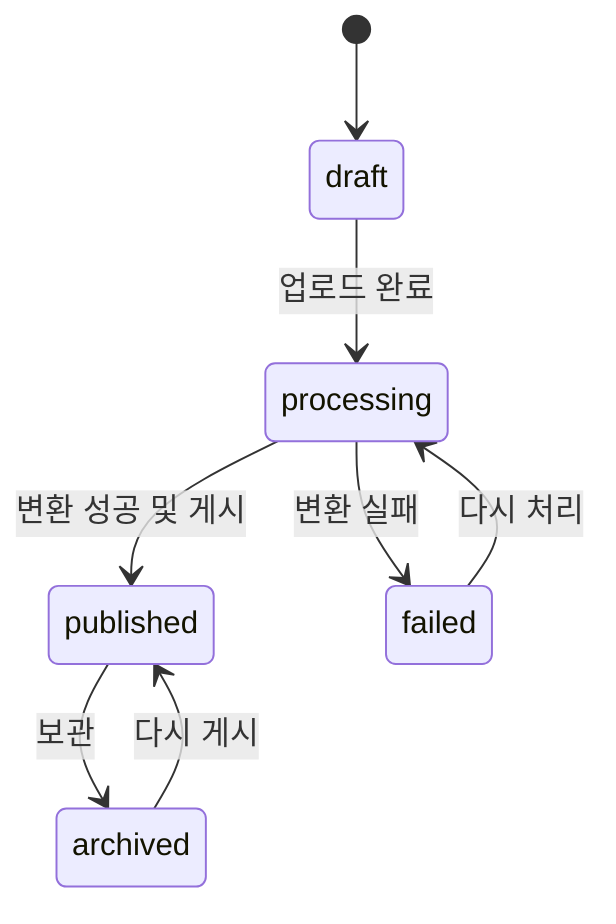
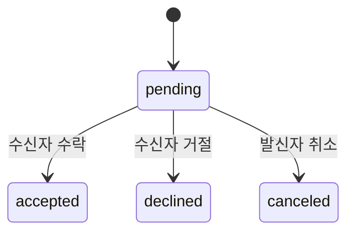

# Scouty 제품 요구사항 문서(PRD)

> **SCOUTY**  
> **말보다는 만든 것으로**

| 항목 | 내용 |
|---|---|
| 문서 버전 | 1.1 |
| 상태 | MVP 개발 기준선 |
| 작성일 | 2026-08-06 |
| 제품 형태 | 모바일 우선 반응형 웹 애플리케이션 |

---

## 1. 문서 목적

이 문서는 Scouty MVP에서 **무엇을 만들고 어떤 조건을 만족해야 하는지** 정의하는 단일 제품 기준이다. 구현 방식, API 경로, 물리 데이터베이스 스키마 등은 별도 기술 설계에서 결정하되 이 문서의 사용자 경험과 비즈니스 규칙을 바꾸지 않는다.

설정 가능한 숫자(업로드 용량, 발송 한도, 쿨다운 등)는 아래 값을 MVP 기본값으로 사용한다.

---

## 2. 제품 정의

### 2.1 한 줄 정의

Scouty는 대학생이 **자기소개보다 프로젝트 결과물을 먼저 보고**, 마음에 든 작업을 만든 사람에게 구체적인 팀 합류 제안을 보내 대화로 연결되는 프로젝트 기반 팀빌딩 서비스다.

### 2.2 해결하려는 문제

- 자기소개·학교·기술 스택만으로는 실제 작업 방식을 판단하기 어렵다.
- 포트폴리오가 외부 링크에 흩어져 있어 여러 후보를 비교하기 어렵다.
- 모집 글을 올리고 기다리는 방식으로는 필요한 역할의 사람을 능동적으로 찾기 어렵다.
- 승인 전 무작위 DM은 보내는 사람과 받는 사람 모두에게 부담을 준다.
- 수업 과제나 작은 개인 작업을 가진 입문자는 채용형 프로필에서 불리하다.

### 2.3 핵심 해결 방식

```text
프로젝트 발견 → 맡은 역할 확인 → 작성자 확인 → 스카우트 제안
→ 상대 수락 → 인앱 채팅 → 상호 매너 평가
```

사용자는 기존 PDF를 올려 포트폴리오를 만든다. Scouty는 PDF를 모바일에서 읽기 좋은 연속 이미지로 변환한다. 팀원을 찾는 사용자는 역할별로 프로젝트를 탐색하고, 마음에 든 작업을 근거로 구체적인 제안을 보낸다.

### 2.4 제품 목표

1. 기존 PDF로 3분 안에 첫 포트폴리오를 게시할 수 있게 한다.
2. 원하는 역할의 프로젝트를 빠르게 탐색하게 한다.
3. 모든 제안에 `어떤 작업을 보고 보냈는지`가 남게 한다.
4. 승인 전 자유 DM을 막고 승인된 관계만 채팅으로 연결한다.
5. 실력 순위가 아닌 최소한의 소통 신뢰 정보를 제공한다.
6. 수업 과제·개인 작업·연습 작업도 동등하게 게시할 수 있게 한다.

### 2.5 비목표

MVP는 다음을 제공하지 않는다.

- 실력 검증, 등급, 랭킹, 프로젝트 진위 보증
- 공개 별점·리뷰·부정 평가·매너 태그
- 학교·학년·경력·자격증·기술 스택 중심 인재 검색
- 이력서 작성, 포트폴리오 제작 교육, 앱 내 과제
- 프로젝트 공동 작성자 또는 팀 계정
- 모집 게시판, 공개 댓글, 팔로우, 승인 전 DM
- 팀 결성 후 일정·업무·문서·코드 관리
- 급여, 계약, 결제, 정규직 채용
- 공개 프로필의 외부 연락처 노출
- AI 기반 포트폴리오 생성·요약·평가

---

## 3. 브랜드와 제품 원칙

### 3.1 브랜드 기준

| 요소 | 기준 |
|---|---|
| 서비스명 | `Scouty`, 워드마크는 `SCOUTY` |
| 슬로건 | `말보다는 만든 것으로` |
| Primary | 로고에서 추출한 `#6155F5` |
| 심볼 | 확정된 별·궤도 모티프 |

로고 사용법과 전체 토큰은 [디자인 시스템](./DESIGN_SYSTEM.md)을 따른다. 기능 코드에 브랜드 색상을 하드코딩하지 않는다.

### 3.2 카피 원칙

- `매칭`, `지원`, `채용`보다 `발견`, `제안`, `스카우트`를 사용한다.
- 사람을 평가하거나 탈락시키는 표현을 쓰지 않는다.
- 프로젝트를 넘기는 행위에 부정적 평가 의미를 부여하지 않는다.
- 숫자와 상태는 압박이 아니라 판단에 필요한 맥락으로 제시한다.

### 3.3 제품 원칙

- **Project First:** 탐색 단위는 사람이 아니라 프로젝트다.
- **Proof, Not Profile:** 자기소개보다 실제 결과물을 먼저 보여준다.
- **Upload Like Instagram, Read Like Behance:** 등록은 짧고 결과 열람은 깊게 만든다.
- **Fast Discovery, Deep Detail:** 스카우트에서는 빠르게 넘기고 상세에서는 전체 작업을 읽는다.
- **Connection, Not Management:** 발견부터 승인 후 첫 대화까지만 책임진다.
- **Manner, Not Ranking:** 응답·매너 정보는 연락 가능성의 보조 지표이며 실력 순위가 아니다.

---

## 4. 사용자와 핵심 과업

### 4.1 팀원을 찾는 사용자

- 필요한 역할을 선택한다.
- 해당 역할로 만든 프로젝트를 연속해서 탐색한다.
- 프로젝트 전체와 작성자의 다른 작업, 응답·매너 정보를 확인한다.
- 역할·기간·활동량이 포함된 제안을 보낸다.
- 상대가 수락하면 인앱 채팅을 시작한다.

### 4.2 작업물을 올리는 사용자

- PDF와 최소한의 메타데이터로 포트폴리오를 게시한다.
- 선택적으로 프로젝트 영상 하나를 첨부한다.
- 스카우트 수신 상태를 조절한다.
- 어떤 작업물을 근거로 제안이 왔는지 확인한다.
- 제안을 수락하거나 거절하고 수락한 사람과 채팅한다.

### 4.3 입문 사용자

출시·수상 경력이 없어도 수업 과제, 개인 연습, 작은 작업을 같은 방식으로 올릴 수 있다. 포트폴리오가 없어도 공개 콘텐츠 탐색은 가능하지만 스팸 방지를 위해 제안 발송 전 게시된 포트폴리오 1개가 필요하다.

---

## 5. 정보 구조와 권한

### 5.1 1-depth 탭

로그인 후 기본 진입 탭은 `피드`다.

| 순서 | 탭 | 역할 | 핵심 액션 |
|---:|---|---|---|
| 1 | 피드 | 여러 프로젝트를 비교·탐색 | 상세, 저장, 작성자 보기 |
| 2 | 스카우트 | 선택한 역할의 프로젝트를 한 장씩 탐색 | 다음, 저장, 상세, 제안 |
| 3 | 채팅 | 승인된 관계에서 대화 | 텍스트·이미지·링크 전송 |
| 4 | 제안 | 받은/보낸 제안 관리 | 수락, 거절, 취소, 채팅 이동 |
| 5 | 프로필 | 소개·역할·상태·포트폴리오 관리 | 프로젝트 추가, 프로필 편집 |

피드와 스카우트는 동일한 `published` 포트폴리오를 서로 다른 밀도와 정렬 방식으로 보여준다. 별도의 `등록` 탭은 두지 않는다.

### 5.2 인증 상태별 권한

| 동작 | 비로그인 | 프로필 미완성 | 프로필 완성 |
|---|---:|---:|---:|
| 공개 피드·프로젝트·프로필 열람 | 가능 | 가능 | 가능 |
| 프로젝트 저장 | 로그인 필요 | 가능 | 가능 |
| 포트폴리오 게시 | 불가 | 프로필 완성 필요 | 가능 |
| 스카우트 발송 | 불가 | 프로필 완성 필요 | 게시물 1개 이상 필요 |
| 기존 제안 처리·채팅 | 불가 | 가능 | 가능 |
| 매너 평가 | 불가 | 기존 관계가 있으면 가능 | 자격 충족 시 가능 |

인증이 필요한 화면은 로그인 후 원래 목적지로 복귀해야 한다. 딥링크, 새로고침, 뒤로 가기에서도 주요 탐색 상태를 복원한다.

---

## 6. 기능 요구사항

### 6.1 로그인과 프로필

- 로그인은 Google OAuth만 지원한다. 비밀번호 로그인과 다른 소셜 로그인은 제공하지 않는다.
- 첫 로그인 후 프로필이 없으면 온보딩으로 이동한다.
- 프로필 완성 후 피드로 이동하며 첫 포트폴리오 등록은 강제하지 않는다.
- 닉네임으로 핸들 후보를 만들고 중복 시 숫자 suffix를 붙인다. 사용자가 수정할 수 있으며 서버에서 중복을 최종 검증한다.
- 프로필 완성 시각은 아래 필수값이 모두 유효할 때만 기록한다.

| 필드 | 필수 | 제한 |
|---|---:|---|
| 아바타 | 예 | JPG/PNG/WebP, 최대 5MB |
| 닉네임 | 예 | 2~20자 |
| 핸들 | 예 | 영문 소문자·숫자·밑줄, 3~20자, 대소문자 무관 고유 |
| 바이오 | 예 | 1~160자 |
| 역할 | 예 | 1~3개 |
| 편한 소통 방식 | 아니요 | 최대 60자, 공개 연락처 입력을 유도하지 않음 |
| 스카우트 상태 | 예 | `open`, `selective`, `closed`; 기본값 `selective` |

상태 문구는 다음 의미를 유지한다.

- `open`: 적극적으로 받고 있어요
- `selective`: 좋은 제안이면 확인해요
- `closed`: 지금은 받지 않아요

학교, 학년, 경력, 기술 스택, 활동 지역은 프로필 필드로 추가하지 않는다.

### 6.2 역할 관리

역할은 코드 enum이 아니라 운영 가능한 관계형 데이터로 관리한다.

| 그룹 | 초기 역할 |
|---|---|
| 기획 | 서비스 기획, PM |
| 디자인 | UI·UX 디자인, 그래픽 디자인, 브랜딩 디자인 |
| 개발 | 프론트엔드, 백엔드, 모바일, 게임, AI·데이터 |
| 콘텐츠 | 영상, 마케팅, 콘텐츠 |
| 운영 | 발표, 리서치, 프로젝트 운영 |

- 사용자가 새 역할을 자유 텍스트로 만들 수 없다.
- 역할은 삭제하지 않고 비활성화한다. 기존 연결은 유지하고 신규 선택에서만 숨긴다.
- 사용자와 포트폴리오는 각각 최대 3개 역할을 가진다.
- 사용자 역할은 맡을 수 있는 역할, 포트폴리오 역할은 해당 작업에서 보여준 역할이다.
- 탐색 필터는 포트폴리오 역할, 제안 역할 자격은 사용자 역할을 기준으로 한다.

### 6.3 포트폴리오 등록과 처리

등록은 내 프로필의 `새 프로젝트 추가`에서 시작하며 다음 순서를 유지한다.

```text
PDF 선택 → 제목·역할·해시태그 입력 → 영상 선택 또는 건너뛰기
→ 처리 상태 확인 → 게시
```

| 필드 | 필수 | 제한 |
|---|---:|---|
| 제목 | 예 | 1~60자 |
| 역할 | 예 | 운영 역할 중 1~3개 |
| 해시태그 | 예 | 1~5개, 태그당 2~20자, 저장 시 `#` 제거 |
| PDF | 예 | PDF, 최대 50MB, 최대 50페이지 |
| 영상 | 아니요 | 1개, MP4/WebM/MOV, 최대 200MB·3분 |

별도 소개 문장, 프로젝트 유형, 기술 스택, 기간, 기여도, 상세 본문은 요구하지 않는다. 설명은 PDF 안에서 자유롭게 표현한다.

처리 규칙:

1. 클라이언트는 signed upload URL로 원본을 업로드한다.
2. 업로드 완료 후 상태를 `processing`으로 전환한다.
3. 격리된 백그라운드 작업이 페이지별 상세 이미지와 썸네일을 생성하고 페이지 번호·크기를 저장한다.
4. PDF 1페이지를 기본 커버로 사용한다.
5. 모든 필수 파생 파일이 준비된 뒤에만 게시할 수 있다.
6. 실패 원인과 재처리 액션을 제공하며 재시도는 중복 결과를 만들지 않는다.
7. 영상 처리만 실패하면 PDF를 보존하고 영상 제거 후 게시하거나 다시 처리할 수 있다.

편집과 보관:

- 게시 후 제목, 역할, 해시태그, 영상을 수정할 수 있다.
- PDF 교체는 전체를 다시 처리하며 실패 시 기존 게시 버전을 유지한다.
- 기본 제거 동작은 삭제가 아닌 `archived`다. 보관 즉시 공개 탐색에서 숨기며 다시 게시할 수 있다.
- 커버 페이지 변경은 P1이며 MVP는 항상 1페이지를 사용한다.

### 6.4 피드와 스카우트 탐색

#### 피드

- 카드에 커버, 제목, 작성자, 역할 최대 2개, 태그 최대 3개, 영상 여부, 저장 액션을 표시한다.
- 역할 필터는 포트폴리오 역할을 기준으로 한다.
- 검색은 제목과 정규화된 태그 이름을 대상으로 한다.
- 기본 정렬은 최신 게시순이며 cursor 방식으로 20개씩 불러온다.
- 본인 프로젝트와 양방향 차단 관계의 프로젝트는 제외한다.
- `closed` 작성자의 프로젝트도 볼 수 있지만 제안 CTA는 비활성화한다.

#### 스카우트

- 사용자가 역할을 먼저 선택하고 한 번에 한 프로젝트를 본다.
- PDF 1페이지를 주 시각 요소로 사용하고 작성자·제목·역할·태그를 함께 표시한다.
- 영상이 있어도 자동 재생하지 않고 영상 배지만 표시한다.
- 액션은 `다음`, `저장`, `상세`, `스카우트 제안`으로 제한한다.
- 세로 스와이프와 동일 기능의 버튼을 모두 제공한다. 좌우 스와이프에는 평가 의미를 부여하지 않는다.
- `published`, 선택 역할 일치, 작성자 상태 `open|selective`, 본인 아님, 차단 관계 아님을 모두 만족한 콘텐츠만 노출한다.
- 최신순을 기본으로 하되 같은 작성자의 프로젝트가 연속으로 나오지 않게 섞고, 같은 세션에서 본 프로젝트는 뒤로 보낸다.

두 화면 모두 로딩, 결과 없음, 오류와 재시도 상태를 제공한다. 저장 상태는 피드·스카우트·상세·프로필에서 일치해야 한다.

### 6.5 프로젝트 상세와 프로필

프로젝트 상세는 다음 순서로 표시한다.

```text
작성자·제목·역할·해시태그
→ 영상 1개(있는 경우)
→ PDF 페이지 이미지 전체
→ 작성자 요약·다른 프로젝트·제안 CTA
```

- 브라우저 기본 PDF 뷰어를 사용하지 않는다.
- 원본 종횡비를 유지한 페이지 이미지를 끊김 없는 세로 스크롤로 표시한다.
- 첫 페이지를 우선 로드하고 나머지는 viewport 근처에서 lazy loading한다.
- 영상은 자동 재생하지 않으며 재생 전 음소거 상태다.
- 작성자가 `closed`이면 제안 CTA 대신 상태 안내를 표시한다.

공개 프로필은 다음 정보만 제공한다.

- 아바타, 닉네임, 핸들, 역할, 스카우트 상태, 바이오
- 편한 소통 방식(입력된 경우)
- 매너 온도, 평균 응답 시간, 제안 응답률
- 보낸·받은 스카우트 수
- 게시된 포트폴리오

내 프로필에서는 프로필 편집, 상태 변경, 프로젝트 등록·수정·보관·처리 상태 확인, 저장 목록, 계정 설정을 제공한다. 저장 수는 공개하지 않는다.

### 6.6 스카우트 제안

다음 조건을 모두 만족해야 제안을 보낼 수 있다.

- 로그인 및 프로필 완성
- 발신자에게 게시된 포트폴리오 1개 이상 존재
- 대상이 본인이 아니고 상태가 `open` 또는 `selective`
- 양방향 차단 관계가 아님
- 근거 포트폴리오가 현재 게시 상태
- 요청 역할이 대상 사용자의 역할 중 하나
- 같은 발신자·수신자·근거 포트폴리오 조합에 대기 중 제안이 없음

| 필드 | 필수 | 제한 |
|---|---:|---|
| 보고 제안한 포트폴리오 | 자동 | 발송 시 제목도 스냅샷으로 보존 |
| 필요한 역할 | 예 | 대상 사용자의 역할 중 1개 |
| 제안 프로젝트명 | 예 | 1~80자 |
| 프로젝트 한 줄 소개 | 예 | 1~160자 |
| 예상 기간 | 예 | 1~60자 |
| 주당 예상 활동량 | 예 | 1~60자 |
| 현재 팀 구성 | 예 | 1~120자 |
| 제안 메시지 | 예 | 1~500자 |

제안 상세와 채팅 상단에는 항상 다음 문맥을 유지한다.

> `[포트폴리오 제목]` 프로젝트를 보고 `[역할명]` 역할로 제안했어요.

상태와 액션:

- 수신자는 `pending` 제안을 수락하거나 거절한다.
- 발신자는 `pending` 제안을 취소할 수 있다.
- `accepted`, `declined`, `canceled`는 되돌릴 수 없는 종결 상태다.
- 거절 사유는 요구하지 않는다.
- 거절 후 같은 대상에게 7일간 새 제안을 보낼 수 없다.
- 계정당 발송 한도 기본값은 24시간에 10건이다.
- 신고·스팸·테스트로 무효 처리된 제안은 통계에서 제외한다.

수락은 하나의 원자적 처리로 상태 변경, 응답 시각 기록, 제안당 하나의 채팅방 생성, 시스템 메시지와 양쪽 알림 생성을 완료한다. 동시 요청이나 재시도에도 종결 상태와 채팅방이 중복되면 안 된다.

제안 탭은 받은 제안과 보낸 제안으로 나누고 상대, 역할, 프로젝트명, 근거 포트폴리오, 상태, 생성 시각, 읽지 않음을 표시한다. 참여자만 상세에 접근할 수 있다.

### 6.7 채팅

- 수락된 제안당 정확히 하나의 채팅방을 만든다.
- 승인 전 자유 메시지는 허용하지 않는다.
- 두 참여자와 운영 권한이 있는 관리자만 접근할 수 있다.
- 상단에 상대 프로필과 신고·차단 메뉴, 제안 문맥 카드를 고정한다.
- 텍스트, 이미지, 안전한 `http`/`https` 링크를 지원한다.
- 차단 후 기존 채팅은 읽기 전용으로 전환한다.

| 종류 | 제한 |
|---|---|
| 텍스트 | 메시지당 2,000자 |
| 이미지 | JPG/PNG/WebP, 장당 10MB, 한 번에 최대 4장 |
| 파일·음성·영상 | 미지원 |

실시간 연결이 끊기면 cursor로 누락 메시지를 복구한다. 클라이언트 생성 메시지 ID로 재시도 중복을 막고, 마지막 읽은 메시지를 기준으로 읽지 않은 수를 계산한다.

온라인 상태, 입력 중 표시, 메시지 반응, 메시지 검색은 MVP에서 제외한다.

### 6.8 매너와 활동 통계

제안이 수락되고 양쪽 모두 일반 메시지를 1개 이상 보낸 뒤 각 참여자에게 한 번만 평가 기회를 준다.

> 이번 소통은 어땠나요?

- `좋았어요` → `positive`
- `아쉬웠어요` → `negative`

자유 리뷰·사유·태그·별점은 받지 않으며 제출 후 수정할 수 없다.

매너 온도:

```text
초기값 = 36.5°
signedSum = positiveCount - negativeCount
temperature = roundTo1Decimal(
  clamp(0, 99, 36.5 + 13.5 × signedSum / (evaluationCount + 5))
)
```

- 원본 평가를 보존하고 온도는 재계산 가능한 캐시로 관리한다.
- 계산식 버전을 함께 저장한다.
- 평가 0건은 `36.5° · 첫 매너 평가 전`으로 표시한다.
- 긍정·부정 건수는 공개하지 않으며 온도를 노출 순위에 사용하지 않는다.

활동 통계:

- 보낸·받은 수는 실제 발송·수신된 유효 제안 수다. 사용자 취소는 포함하고 운영 무효 처리는 제외한다.
- 평균 응답 시간은 수신부터 수락 또는 거절까지의 평균이다. 표본 3건 미만은 부족 안내를 표시한다.
- 응답률은 `수락 또는 거절 수 / 응답 대상 제안 수`다.
- 응답 대상은 이미 응답했거나 생성 후 72시간이 지난 대기 제안이다. 취소·운영 무효 처리는 제외한다.
- 응답 대상 5건 미만은 비율 대신 부족 안내를 표시한다.
- 이벤트 발생 후 5분 안에 통계를 반영하고, 72시간 경과 반영을 위해 최소 1시간마다 재집계한다.
- 모든 통계는 원본 제안·평가 데이터에서 복구할 수 있어야 한다.

### 6.9 알림, 신고와 차단

P0 인앱 알림:

- 새 스카우트 제안
- 보낸 제안의 수락·거절
- 새 채팅 메시지
- 매너 평가 가능 상태
- 내 포트폴리오 처리 완료·실패

제안과 채팅 탭에는 각각 읽지 않은 수를 표시한다. 푸시·이메일 알림은 P1이다.

신고 대상은 사용자, 포트폴리오, 제안, 메시지다. 도용·사칭, 스팸 제안, 괴롭힘, 개인정보 요구, 무관한 영리 홍보를 구분할 수 있는 사유 코드를 저장한다.

- 차단 즉시 양쪽의 탐색 노출과 새 제안을 막는다.
- 기존 채팅은 읽기 전용으로 유지한다.
- 신고만으로 공개 통계나 매너 온도를 즉시 바꾸지 않는다.
- 운영자는 콘텐츠 임시 숨김과 신고 상태 변경을 할 수 있어야 한다. 운영 UI는 P1이어도 서버 기능은 P0에 포함한다.

---

## 7. 핵심 상태와 데이터 무결성

### 7.1 상태 머신





제안 만료 상태는 두지 않는다. 오래된 `pending`도 참여자가 직접 처리할 수 있다.

### 7.2 핵심 도메인

| 도메인 | 주요 개체 |
|---|---|
| 계정 | 사용자, 프로필, 사용자 역할 |
| 콘텐츠 | 에셋, 포트폴리오, 페이지, 포트폴리오 역할, 태그, 저장 |
| 연결 | 스카우트 제안, 채팅방, 메시지, 읽음 상태 |
| 신뢰 | 매너 평가, 사용자 통계, 차단, 신고 |
| 알림 | 사용자별 인앱 알림 |

모든 ID는 UUID, 모든 시각은 UTC 저장을 기본으로 한다.

### 7.3 필수 무결성 규칙

- OAuth 제공자와 제공자 내 식별자 조합은 고유하다.
- 핸들은 대소문자와 무관하게 고유하다.
- 역할·태그·저장 관계는 중복될 수 없다.
- 포트폴리오 페이지 번호는 포트폴리오 안에서 고유하다.
- 제안 발신자와 수신자는 달라야 하며 근거 포트폴리오의 작성자는 수신자여야 한다.
- 같은 발신자·수신자·근거 포트폴리오에 `pending` 제안은 하나만 존재한다.
- 채팅방은 제안당 하나만 존재한다.
- 메시지는 발신자와 클라이언트 메시지 ID 조합으로 중복을 막는다.
- 매너 평가는 관계별 평가자당 한 번만 존재한다.
- 원본 에셋의 저장 키나 비공개 URL을 공개 API 데이터로 노출하지 않는다.

---

## 8. 분석과 성공 기준

### 8.1 핵심 퍼널

```text
가입 → 프로필 완성 → 첫 포트폴리오 게시 → 프로젝트 상세 조회
→ 작성자 프로필 조회 → 스카우트 발송 → 수락 → 양쪽 첫 메시지
```

최소한 퍼널 단계, 포트폴리오 처리 성공·실패, 저장, 매너 평가, 신고를 측정한다. 분석 데이터에 이메일, 바이오, 제안·채팅 본문 등 개인정보나 자유 텍스트를 보내지 않는다.

### 8.2 제품 지표

- 프로필 완성률
- 가입 후 첫 포트폴리오 게시율
- PDF 업로드 시작 대비 게시 성공률
- 노출 → 상세 → 작성자 프로필 → 제안 전환율
- 수신 제안 응답률과 수락률
- 수락 후 양쪽 첫 메시지 완료율
- 가입 후 첫 제안을 받기까지 걸린 시간

### 8.3 사용자 검증 기준

- 처음 본 사용자가 10초 안에 서비스 목적을 설명할 수 있다.
- 1분 동안 역할 필터로 프로젝트 5개 이상을 탐색할 수 있다.
- 기존 PDF로 3분 안에 게시를 완료할 수 있다.
- 수신자가 어떤 작업물을 근거로 받은 제안인지 즉시 이해할 수 있다.

---

## 9. 비기능 요구사항

### 9.1 성능과 신뢰성

- 피드 API p95는 캐시 적중 기준 500ms 이하를 목표로 한다.
- 보급형 모바일·4G 환경의 첫 화면 LCP는 2.5초 이내를 목표로 한다.
- 화면 크기에 맞는 이미지 파생 파일과 CDN을 사용한다.
- 정상 연결에서 메시지는 전송 후 1초 안에 상대 화면 반영을 목표로 한다.
- PDF 처리는 단계별 재시도와 멱등성을 보장한다.
- 업로드·변환 실패율, 메시지 전달 지연, 통계 집계 지연을 모니터링한다.

### 9.2 접근성

- 모든 주요 기능은 키보드로 조작할 수 있다.
- 버튼과 PDF 페이지에 접근 가능한 이름을 제공한다.
- 텍스트 대비는 WCAG AA를 만족한다.
- 스와이프 액션에는 같은 기능의 버튼을 제공한다.
- 매너 상태를 색만으로 구분하지 않는다.

### 9.3 보안과 개인정보

- OAuth 토큰과 세션을 서버 측에서 안전하게 관리한다.
- 업로드 파일은 확장자가 아닌 MIME과 파일 시그니처를 검증한다.
- PDF와 영상 처리는 격리된 환경에서 수행한다.
- 비공개 에셋은 권한 확인 후 만료되는 URL로 제공한다.
- 외부 링크는 `http`/`https`만 허용하고 안전한 새 창 속성을 적용한다.
- 로그에 채팅 본문, OAuth 토큰, signed URL을 남기지 않는다.
- 계정 삭제 시 공개 데이터를 즉시 숨기고 보존 기간 이후 개인정보를 파기한다.

---

## 10. 출시 범위

### 10.1 P0

- Google OAuth 로그인과 프로필 생성·편집
- 운영형 역할 목록, 다중 역할, 스카우트 수신 상태
- PDF 필수·영상 선택 포트폴리오 등록, 변환, 게시, 수정, 보관, 재처리
- 피드, 역할·태그 탐색, 스카우트 연속 탐색, 저장
- 공개·내 프로필과 활동·매너 정보
- 스카우트 제안 발송, 받은/보낸 제안, 수락·거절·취소
- 수락 시 채팅방 자동 생성, 텍스트·이미지·링크 채팅, 읽지 않음
- 매너 평가와 응답·활동 통계
- 인앱 알림, 사용자 차단, 신고 API와 운영 상태

### 10.2 P1

- 푸시·이메일 알림
- PDF 커버 페이지 선택
- 영상 썸네일·트랜스코딩 고도화
- 인기·추천 피드와 검색 고도화
- 프로필 내 프로젝트 순서·대표 프로젝트 설정
- 운영자 신고 처리 UI
- 메시지 삭제와 채팅방 보관
- 포트폴리오 외부 공유 링크 최적화

### 10.3 명시적 제외

- AI 포트폴리오 생성·요약·평가와 자동 영상 생성
- 스카우트 영상 자동 재생
- 프로젝트 공동 작성자와 팀 계정
- 모집 게시판, 공개 댓글, 팔로우
- 음성·영상·일반 파일 채팅
- 온라인 상태, 입력 중 표시, 메시지 반응
- 일정·칸반·업무 관리
- 학교 인증, 기업 계정, 유료 기능
- 실력 점수, 공개 추천 순위, 공개 리뷰

---

## 11. MVP 완료 조건

다음 흐름이 실제 데이터와 권한 검증을 거쳐 중단 없이 동작해야 한다.

> 로그인 → 프로필 완성 → PDF 포트폴리오 게시 → 역할 기반 탐색 → 프로젝트·작성자 확인 → 스카우트 발송 → 수락 → 채팅 → 매너 평가 → 통계 반영

핵심 인수 조건:

- 처리 중이거나 실패한 포트폴리오는 공개 탐색에 나타나지 않는다.
- PDF 페이지는 순서와 비율을 유지하며 영상이 있으면 상세 최상단에 표시된다.
- `closed` 사용자는 스카우트 탐색과 제안 대상에서 제외된다.
- 게시물이 없는 사용자는 제안을 보낼 수 없다.
- 제안에는 근거 포트폴리오와 요청 역할이 항상 포함된다.
- 동시에 수락·거절·취소해도 하나의 종결 상태만 기록된다.
- 수락을 재시도해도 채팅방은 하나만 생성된다.
- 참여자가 아닌 사용자는 제안, 채팅, 비공개 에셋에 접근할 수 없다.
- 메시지 재시도가 중복 메시지를 만들지 않는다.
- 양쪽이 메시지를 보내기 전에는 매너 평가를 할 수 없다.
- 동일 관계에서 같은 사용자가 두 번 평가할 수 없다.
- 저장·읽지 않음·통계 상태가 관련 화면에서 일관되게 보인다.

---

## 12. 구현 전 확정 사항

- Product·Design이 검수한 초기 역할 seed
- 배포 환경에 맞춘 PDF·영상 용량 제한
- PDF 변환 실패 코드와 사용자 안내 문구
- 실시간 채팅 전송 방식과 백그라운드 작업 큐
- 신고 사유 코드와 최소 운영 절차
- 시연용 포트폴리오의 사용 권리와 개인정보 확인
