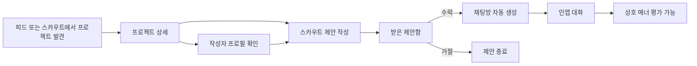
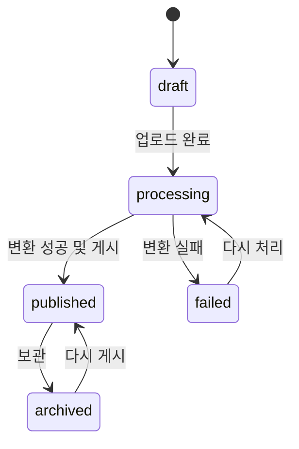
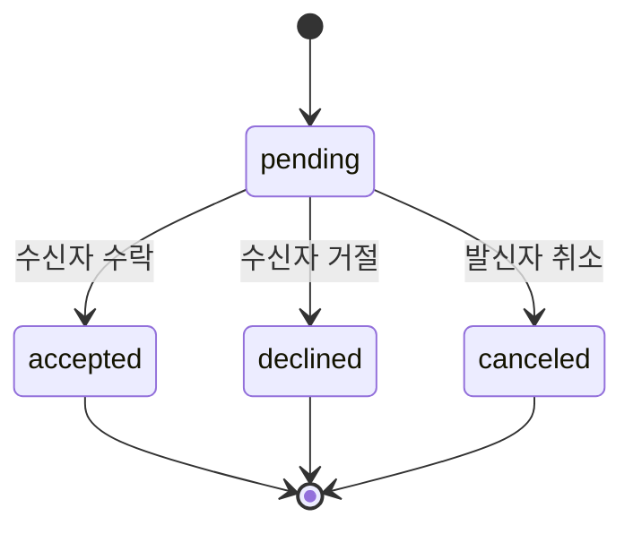

# Scouty 상세 제품 요구사항 문서(PRD)

> **SCOUTY**  
> **말보다는 만든 것으로**

| 항목 | 내용 |
|---|---|
| 문서 버전 | 1.0 |
| 상태 | MVP 개발 기준선 |
| 작성일 | 2026-08-06 |
| 대상 | Product, Design, Frontend, Backend, QA |
| 제품 형태 | 모바일 우선 반응형 웹 애플리케이션 |

---

## 0. 문서의 역할과 결정 우선순위

이 문서는 Scouty MVP의 단일 구현 기준이다. 이전 논의 중 아래와 같이 방향이 바뀐 항목은 **이 문서의 최종안**을 따른다.

- 이미지·콘텐츠 블록 기반 포트폴리오 등록안 대신 **PDF 필수 + 영상 1개 선택 첨부** 방식을 사용한다.
- 영상 숏폼 제작을 요구하지 않는다. 숏폼에서 가져오는 것은 콘텐츠 형식이 아니라 **빠른 탐색 방식**이다.
- `등록` 탭을 두지 않는다. 프로젝트 등록은 **프로필 탭 안에서** 시작한다.
- 1-depth 탭은 **피드 · 스카우트 · 채팅 · 제안 · 프로필**로 고정한다.
- 제안 수락 후 외부 연락처만 공개하는 방식 대신 **인앱 채팅방을 자동 생성**한다.
- 역할은 애플리케이션 enum이 아니라 운영 가능한 **Role 릴레이션**으로 관리한다.
- 사용자 프로필에서 온·오프라인, 학교, 학년, 기술 스택, 활동 지역을 구조화해 받지 않는다.
- 매너 태그·별점·공개 후기를 두지 않는다. **긍정/부정 평가를 매너 온도로 환산**한다.
- 공개 활동 지표는 **보낸 스카우트 수, 받은 스카우트 수, 평균 응답 시간, 제안 응답률, 매너 온도**로 제한한다.

값의 길이, 업로드 용량, 쿨다운처럼 이전 논의에서 숫자가 확정되지 않은 항목은 이 문서의 **MVP 기본값**을 사용하되 서버 설정으로 변경 가능하게 구현한다.

---

## 1. 제품 개요

### 1.1 한 줄 정의

Scouty는 대학생이 **사람의 자기소개보다 프로젝트 결과물을 먼저 보고**, 마음에 든 작업을 만든 사람에게 구체적인 팀 합류 제안을 보내 대화로 연결되는 프로젝트 기반 팀빌딩 서비스다.

### 1.2 핵심 문제

기존 팀원 모집은 다음 순서로 진행되는 경우가 많다.

> 모집 글 → 자기소개·학교·기술 스택 → 외부 포트폴리오 링크 확인 → 연락

이 방식에는 다음 문제가 있다.

- 모두가 자신을 `열정적`, `책임감 있음`으로 설명해 실제 작업 방식을 구분하기 어렵다.
- 포트폴리오가 여러 외부 링크에 흩어져 있어 후보를 비교하는 비용이 높다.
- 모집 글을 올리고 기다려야 하므로 원하는 직군의 사람을 능동적으로 찾기 어렵다.
- 처음 연락하는 행위가 부담스럽고, 무작위 DM은 받는 사람에게 피로를 준다.
- 수업 과제나 작은 개인 프로젝트를 가진 학생은 전통적인 채용형 프로필에서 불리하다.

### 1.3 해결 방식

Scouty는 탐색 순서를 다음과 같이 뒤집는다.

> **프로젝트 → 프로젝트에서 맡은 역할 → 사람 → 스카우트 제안 → 승인 → 채팅**

사용자는 이미 만든 발표 자료나 포트폴리오 PDF를 올린다. Scouty는 PDF를 모바일에서 읽기 좋은 연속 이미지 포트폴리오로 변환한다. 팀원을 찾는 사용자는 역할을 선택해 프로젝트를 빠르게 탐색하고, 특정 작업물을 근거로 스카우트 제안을 보낸다.

### 1.4 제품 목표

1. 기존 PDF 하나로 3분 안에 첫 포트폴리오를 게시할 수 있게 한다.
2. 원하는 역할의 후보 프로젝트를 빠르게 탐색하게 한다.
3. 모든 제안이 `어떤 작업을 보고 보냈는지`를 포함하게 한다.
4. 승인 전 자유 DM을 막고, 승인된 관계만 채팅으로 이어지게 한다.
5. 실력 순위가 아닌 최소한의 소통 신뢰 정보를 제공한다.
6. 수업 과제·개인 작업·연습 작업도 결과물로 참여할 수 있게 한다.

### 1.5 비목표

MVP는 다음을 제공하지 않는다.

- 사용자의 실력 검증, 등급, 랭킹 또는 프로젝트 진위 보증
- 공개 별점, 공개 리뷰, 공개 부정 평가, 매너 태그
- 이력서 작성, 포트폴리오 제작 교육, 앱 내 과제 제공
- 팀 결성 후 일정·업무·문서·코드 관리
- 급여, 계약, 결제, 정규직 채용
- 학교·학년·경력·자격증 중심의 인재 검색
- 여러 사람이 한 프로젝트의 공동 저자로 등록되는 기능
- 승인 전 DM 또는 제안에 대한 댓글형 대화
- 외부 메신저 아이디나 연락처의 공개 프로필 노출

---

## 2. 브랜드와 제품 원칙

### 2.1 확정 브랜딩

| 요소 | 기준 |
|---|---|
| 서비스명 | `Scouty` / 워드마크 표기 시 `SCOUTY` |
| 슬로건 | `말보다는 만든 것으로` — 문장부호를 붙이지 않는다. |
| 브랜드 컬러 | 파란색 계열을 Primary로 사용한다. 승인된 로고 에셋의 파란색을 최종 토큰으로 추출한다. |
| 심볼 | 승인된 별·궤도 모티프의 심볼을 사용한다. 심볼 내부에 추가 타이포를 넣지 않는다. |
| 감정 | 보내는 사람은 좋은 작업자를 발견했다는 느낌, 받는 사람은 자신의 작업을 인정받았다는 느낌을 준다. |

승인된 원본 로고 에셋이 개발 저장소에 들어오기 전까지의 임시 Primary 토큰은 `#3157F6`으로 한다. 에셋이 추가되면 디자인 토큰만 교체하고 기능 코드에 색상 값을 직접 하드코딩하지 않는다.

### 2.2 카피 원칙

- `매칭`, `지원`, `채용`보다 `발견`, `제안`, `스카우트`를 우선한다.
- 사람을 평가하거나 탈락시키는 표현을 쓰지 않는다.
- 프로젝트를 넘기는 행위는 `싫어요`가 아니라 단순히 `다음 프로젝트`다.
- 숫자와 상태는 압박감보다 판단에 필요한 맥락을 주는 방식으로 표현한다.

대표 카피:

- `당신의 작업물을 보고 스카우트 제안이 도착했어요.`
- `이 프로젝트를 보고 제안했어요.`
- `현재 스카우트 받는 중`
- `아직 응답 정보가 부족해요.`

### 2.3 제품 원칙

#### Project First

탐색의 기본 단위는 사람이 아니라 프로젝트다. 피드와 스카우트 첫 화면에서 작성자의 학교·학년·경력 같은 배경을 강조하지 않는다.

#### Proof, Not Profile

자기소개보다 실제로 만든 결과물을 우선한다. 단, 플랫폼이 결과물의 진위나 실력을 보증하지는 않는다.

#### Upload Like Instagram, Read Like Behance

등록은 짧고 결과는 깊어야 한다. 별도의 장문 소개 입력 없이 PDF 자체가 프로젝트 설명이 된다.

#### Fast Discovery, Deep Detail

스카우트 탭에서는 한 프로젝트에 집중해 빠르게 넘기고, 상세에서는 영상과 PDF 전체를 세로로 깊게 읽는다.

#### Connection, Not Management

Scouty의 책임 범위는 발견, 제안, 승인, 첫 대화까지다. 팀 운영 도구로 확장하지 않는다.

#### Manner, Not Ranking

매너 온도와 응답 지표는 연락 가능성을 판단하는 보조 정보다. 실력이나 사람의 가치를 나타내는 랭킹으로 사용하지 않는다.

---

## 3. 주요 사용자와 핵심 과업

### 3.1 팀원을 찾는 사용자

**상황:** 해커톤, 공모전, 사이드 프로젝트 등에 필요한 특정 역할의 팀원을 직접 찾고 싶다.

**핵심 과업:**

- `UI 디자이너`처럼 원하는 역할을 고른다.
- 그 역할로 만든 프로젝트를 연속해서 본다.
- PDF 전체와 작성자의 다른 작업, 응답·매너 정보를 확인한다.
- 구체적인 역할과 기간이 포함된 제안을 보낸다.
- 상대가 승인하면 바로 인앱 채팅을 시작한다.

### 3.2 작업물을 올리는 사용자

**상황:** 기존 발표 자료나 포트폴리오 PDF를 활용해 새로운 팀 제안을 받고 싶다.

**핵심 과업:**

- PDF를 올리고 제목, 역할, 해시태그만 입력한다.
- 선택적으로 프로젝트 영상 하나를 첨부한다.
- 제안 수신 상태를 조절한다.
- 어떤 작업물을 보고 제안했는지 확인한다.
- 제안을 승인하거나 거절하고, 승인한 사람과 채팅한다.

### 3.3 입문 사용자

**상황:** 출시·수상 경력은 없지만 수업 과제, 개인 연습, 작은 작업 결과가 있다.

**원칙:** Scouty는 작업의 규모나 유형을 별도 등급으로 매기지 않는다. 사용자는 작은 결과도 PDF로 정리해 같은 방식으로 올릴 수 있다. 프로젝트가 없다는 이유로 탐색은 막지 않지만, 스팸 방지를 위해 스카우트 발송 전에는 게시된 포트폴리오 1개를 요구한다.

---

## 4. 정보 구조와 1-depth 탭

로그인 후 기본 진입 탭은 `피드`다.

| 순서 | 탭 | 역할 | 핵심 액션 |
|---:|---|---|---|
| 1 | 피드 | 프로젝트를 천천히 비교·탐색 | 상세 보기, 저장, 작성자 보기 |
| 2 | 스카우트 | 선택한 역할의 프로젝트를 한 장씩 빠르게 발견 | 다음, 저장, 상세, 스카우트 제안 |
| 3 | 채팅 | 승인된 스카우트 관계에서 대화 | 메시지·이미지·링크 전송 |
| 4 | 제안 | 승인 전후의 받은/보낸 제안 상태 관리 | 수락, 거절, 취소, 채팅 이동 |
| 5 | 프로필 | 내 소개·역할·상태·포트폴리오 관리 | 새 프로젝트 추가, 프로필 편집 |

피드와 스카우트는 서로 다른 콘텐츠를 갖지 않는다. 동일한 `published` 포트폴리오를 소비 밀도와 정렬 방식만 다르게 보여준다.

### 4.1 권장 화면 경로

| 화면 | 경로 예시 | 인증 |
|---|---|---:|
| 피드 | `/feed` | 선택 |
| 스카우트 탐색 | `/scout?role=:roleSlug` | 선택, 발송 시 필수 |
| 프로젝트 상세 | `/p/:portfolioId` | 선택 |
| 공개 프로필 | `/@:handle` | 선택 |
| 받은/보낸 제안 | `/proposals?box=inbox` 또는 `/proposals?box=sent` | 필수 |
| 제안 상세 | `/proposals/:requestId` | 참여자만 |
| 채팅 목록 | `/chats` | 필수 |
| 채팅방 | `/chats/:roomId` | 참여자만 |
| 내 프로필 | `/me` | 필수 |
| 프로필 편집 | `/me/edit` | 필수 |
| 포트폴리오 등록 | `/me/portfolios/new` | 프로필 완성 필요 |
| 포트폴리오 편집 | `/me/portfolios/:portfolioId/edit` | 작성자만 |

라우팅 프레임워크가 달라도 뒤로 가기, 딥링크, 새로고침 후 상태 복원이 가능해야 한다. 인증이 필요한 경로는 로그인 후 원래 목적지로 복귀한다.



---

## 5. 공통 권한과 진입 규칙

### 5.1 인증 상태별 권한

| 동작 | 비로그인 | 로그인·프로필 미완성 | 프로필 완성 |
|---|---:|---:|---:|
| 공개 피드/프로젝트/프로필 열람 | 가능 | 가능 | 가능 |
| 프로젝트 저장 | 로그인 유도 | 가능 | 가능 |
| 포트폴리오 게시 | 불가 | 프로필 완성 유도 | 가능 |
| 스카우트 발송 | 불가 | 프로필 완성 유도 | 게시물 1개 이상일 때 가능 |
| 제안 처리·채팅 | 불가 | 기존 관계가 있으면 가능 | 가능 |
| 매너 평가 | 불가 | 기존 관계가 있으면 가능 | 자격 충족 시 가능 |

### 5.2 프로필 완성 조건

다음 값이 모두 유효해야 `profileCompletedAt`을 기록한다.

- 아바타
- 닉네임
- 고유 핸들
- 바이오
- 역할 1개 이상, 최대 3개
- 스카우트 수신 상태

`편한 소통 방식`은 선택값이며 프로필 완성 조건에 포함하지 않는다.

---

## 6. 기능 요구사항

### 6.1 로그인과 온보딩

#### 요구사항

1. MVP는 Google 또는 Kakao OAuth 중 최소 하나를 지원한다.
2. 로그인 성공 후 프로필이 없으면 온보딩으로 이동한다.
3. 닉네임을 기준으로 핸들 후보를 자동 생성하고, 중복 시 숫자 suffix를 붙인다.
4. 사용자는 자동 생성된 핸들을 수정할 수 있다.
5. 역할은 운영자가 관리하는 목록에서 1~3개를 고른다.
6. 스카우트 상태의 기본값은 `selective`다.
7. 첫 포트폴리오 등록을 강제하지 않고 피드로 진입할 수 있다.

#### 입력 기본값과 제한

| 필드 | 필수 | MVP 기본 제한 |
|---|---:|---|
| 아바타 | 예 | JPG/PNG/WebP, 최대 5MB |
| 닉네임 | 예 | 2~20자 |
| 핸들 | 예 | 영문 소문자·숫자·밑줄, 3~20자, 대소문자 무관 unique |
| 바이오 | 예 | 1~160자 |
| 역할 | 예 | 1~3개 |
| 편한 소통 방식 | 아니요 | 60자. 공개 연락처 입력을 유도하지 않는다. |
| 스카우트 상태 | 예 | `open`, `selective`, `closed` |

스카우트 상태 표시 문구:

- `open`: 적극적으로 받고 있어요
- `selective`: 좋은 제안이면 확인해요
- `closed`: 지금은 받지 않아요

### 6.2 피드 탭

#### 목적

여러 프로젝트를 비교적 천천히 훑고 저장하거나 상세로 들어가는 공간이다.

#### 카드 정보

- PDF 1페이지 썸네일
- 프로젝트 제목
- 작성자 닉네임과 아바타
- 역할 최대 2개, 초과 시 `+N`
- 해시태그 최대 3개
- 영상 첨부 여부 아이콘
- 저장 버튼

#### 동작

- 카드 선택 → 프로젝트 상세
- 작성자 선택 → 공개 프로필
- 저장 → 내 프로필의 저장 목록에 반영
- 역할 필터 → `PortfolioRole` 기준 필터링
- 해시태그 검색 → 제목·정규화된 태그 이름 검색
- 스카우트 상태가 `closed`인 작성자의 프로젝트도 피드에서는 볼 수 있지만 제안 CTA는 비활성화한다.

#### MVP 정렬

1. 기본은 `publishedAt DESC`다.
2. 차단 관계와 내가 작성한 프로젝트는 추천 목록에서 제외한다. 내 프로젝트는 프로필에서 확인한다.
3. 페이지네이션은 cursor 방식이며 한 번에 20개를 반환한다.
4. 고급 개인화, 인기 랭킹, AI 추천은 MVP 범위 밖이다.

#### 상태 화면

- 최초 로딩: 카드 스켈레톤
- 결과 없음: `선택한 역할의 프로젝트가 아직 없어요.` + 필터 초기화
- 오류: 재시도 버튼을 유지하고 기존 캐시가 있으면 함께 보여준다.

### 6.3 스카우트 탭

#### 목적

특정 직군의 작업물을 한 프로젝트씩 빠르게 발견한다.

#### 최초 진입

1. 상단 역할 선택기를 표시한다.
2. 사용자의 역할과 최근 선택 역할을 후보로 노출하되 자유롭게 다른 역할을 고를 수 있다.
3. 선택값은 기기와 계정에 저장한다.

#### 프로젝트 카드

- PDF 1페이지를 화면의 주 시각 요소로 사용한다.
- 하단 오버레이에 작성자, 제목, 역할, 해시태그를 표시한다.
- 영상이 있어도 MVP에서는 자동 재생하지 않고 영상 배지만 표시한다.
- 액션은 `저장`, `상세 보기`, `스카우트 제안`으로 제한한다.
- 세로 스와이프 또는 다음 버튼으로 다음 프로젝트를 본다.
- 좌우 스와이프에 평가 의미를 부여하지 않는다.

#### 노출 조건

- `Portfolio.status = published`
- 선택한 `roleId`가 `PortfolioRole`에 존재
- 작성자 `scoutStatus IN (open, selective)`
- 본인 프로젝트가 아님
- 양방향 차단 관계가 아님

#### MVP 정렬

- 같은 역할 안에서 최근 게시물을 기본으로 하되, 한 작성자의 프로젝트가 2개 연속 나오지 않도록 결과를 섞는다.
- 동일 세션에서 이미 본 프로젝트는 뒤로 보낸다.
- 모든 결과를 소진하면 `새 프로젝트가 올라오면 다시 보여드릴게요.`를 표시하고 새로고침할 수 있다.

### 6.4 프로젝트 상세

#### 표시 순서

```text
작성자 · 제목 · 역할 · 해시태그
↓
프로젝트 영상 1개 (첨부된 경우에만)
↓
PDF 1페이지 이미지
↓
PDF 2페이지 이미지
↓
...
↓
작성자 요약 · 다른 프로젝트 · 스카우트 제안 CTA
```

#### 요구사항

1. PDF는 브라우저 기본 뷰어로 보여주지 않는다.
2. 서버에서 변환된 페이지 이미지를 순서대로 끊김 없는 세로 스크롤로 표시한다.
3. 첫 페이지는 우선 로드하고 이후 페이지는 lazy loading한다.
4. 원본 종횡비를 유지하고 작은 화면에서 가로 스크롤이 생기지 않게 한다.
5. 영상은 사용자 동작 전 음소거 상태이며 자동 재생하지 않는다.
6. 상세 진입 출처(`feed`, `scout`, `profile`, `proposal`)를 분석 이벤트에 남긴다.
7. 작성자가 `closed`이면 CTA 대신 `지금은 스카우트를 받지 않아요.`를 표시한다.

### 6.5 포트폴리오 등록·수정·보관

#### 진입점

- 내 프로필 상단의 `+ 새 프로젝트 추가`
- 프로젝트가 없을 때 그리드 전체를 빈 상태 CTA로 사용

#### 등록 흐름

1. **PDF 선택**
2. **제목 · 역할 · 해시태그 입력**
3. **영상 선택 또는 건너뛰기**
4. **처리 상태 확인 후 게시**

한 화면 안에서 단계형 폼으로 구현해도 되지만 논리 순서는 유지한다.

#### 입력 스키마

| 필드 | 필수 | MVP 기본 제한 |
|---|---:|---|
| 제목 | 예 | 1~60자 |
| 작성자 | 자동 | 로그인 사용자 |
| 역할 | 예 | 1~3개, 운영 Role 목록에서 선택 |
| 해시태그 | 예 | 1~5개, 태그당 2~20자, `#`는 저장 시 제거 |
| 소개 자료 PDF | 예 | PDF만, 최대 50MB, 최대 50페이지 |
| 프로젝트 영상 | 아니요 | 1개, MP4/WebM/MOV, 최대 200MB, 최대 3분 |

별도의 한 줄 소개, 프로젝트 유형, 기술 스택, 기간, 기여도, 상세 본문 입력을 강제하지 않는다. 해당 내용은 작성자가 PDF 안에서 자유롭게 표현한다.

#### 처리 규칙

1. 클라이언트는 signed upload URL로 원본을 업로드한다.
2. 업로드 완료 시 포트폴리오는 `processing`이 된다.
3. 백그라운드 작업이 PDF 각 페이지의 상세 이미지와 썸네일을 생성한다.
4. 각 페이지의 번호, 너비, 높이를 저장한다.
5. PDF 1페이지를 기본 커버로 지정한다.
6. 모든 필수 파생 파일 생성이 끝나야 `published`로 전환할 수 있다.
7. 실패 시 사용자에게 실패 이유와 `다시 처리` 액션을 제공한다.
8. 영상 변환 실패 시 PDF는 보존하고 영상을 제거해 게시하거나 재시도할 수 있게 한다.

#### 편집 규칙

- 게시 후 제목, 역할, 해시태그, 영상은 수정할 수 있다.
- PDF 교체는 전체 페이지를 다시 처리한다. 새 버전 처리에 실패하면 기존 게시 버전을 유지한다.
- `삭제` 대신 기본 동작은 `보관(archived)`이다. 보관 즉시 피드와 스카우트에서 숨긴다.
- 보관된 포트폴리오를 다시 게시할 수 있다.
- 커버 페이지 변경 기능은 P1이며 MVP는 항상 1페이지를 사용한다.

### 6.6 공개 프로필과 내 프로필

#### 공개 프로필 표시 순서

1. 아바타, 닉네임, `@handle`
2. 역할 목록
3. 스카우트 상태
4. 바이오
5. 편한 소통 방식(입력된 경우)
6. 매너 온도
7. 평균 응답 시간, 제안 응답률
8. 보낸 스카우트 수, 받은 스카우트 수
9. 게시된 포트폴리오 그리드

예시:

```text
[아바타]
김현호  @hyunho
UI·UX 디자이너 · 그래픽 디자이너
스카우트 받는 중

복잡한 정보를 단순한 화면으로 정리하는 걸 좋아합니다.

편한 소통
Scouty 채팅 우선, 이후 디스코드가 편해요.

매너 38.2°
평균 6시간 내 응답 · 제안 응답률 92%
보낸 스카우트 3 · 받은 스카우트 8

[프로젝트 그리드]
```

#### 내 프로필 추가 기능

- 프로필 편집
- 스카우트 상태 빠른 변경
- 새 프로젝트 추가
- 내 프로젝트 수정·보관·처리 상태 확인
- 저장한 프로젝트 목록
- 로그아웃 및 계정 설정

학교, 학년, 기술 스택, 경력, 활동 지역은 프로필 필드로 추가하지 않는다.

### 6.7 역할 관리

역할은 코드 enum이 아니라 관계형 데이터로 관리한다.

#### 초기 RoleGroup과 Role seed

| 그룹 | 초기 역할 |
|---|---|
| 기획 | 서비스 기획, PM |
| 디자인 | UI·UX 디자인, 그래픽 디자인, 브랜딩 디자인 |
| 개발 | 프론트엔드, 백엔드, 모바일, 게임, AI·데이터 |
| 콘텐츠 | 영상, 마케팅, 콘텐츠 |
| 운영 | 발표, 리서치, 프로젝트 운영 |

#### 운영 규칙

- 사용자가 자유 텍스트로 새 역할을 만들 수 없다.
- 역할은 삭제하지 않고 `isActive = false`로 비활성화한다.
- 비활성 역할이 연결된 기존 데이터는 유지하되 신규 선택 목록에서는 숨긴다.
- 사용자는 최대 3개, 포트폴리오는 최대 3개의 역할을 갖는다.
- `UserRole`은 이 사용자가 맡을 수 있는 역할, `PortfolioRole`은 해당 PDF에서 보여준 역할이다.
- 역할 검색 결과는 `PortfolioRole`을 기준으로 하며, 제안 대상 역할 유효성은 `UserRole`을 기준으로 한다.

### 6.8 스카우트 제안

#### 발송 자격

다음 조건을 모두 만족해야 한다.

- 로그인 및 프로필 완성
- 발신자에게 `published` 포트폴리오가 1개 이상 존재
- 대상 사용자가 본인이 아님
- 대상 사용자의 상태가 `open` 또는 `selective`
- 양방향 차단 관계가 아님
- 근거가 되는 대상 포트폴리오가 현재 `published`
- 요청 역할이 대상 사용자의 `UserRole` 중 하나
- 동일 발신자·수신자·근거 포트폴리오 조합의 `pending` 제안이 없음

#### 제안 작성 필드

| 필드 | 필수 | 제한/설명 |
|---|---:|---|
| 보고 제안한 포트폴리오 | 자동 | `sourcePortfolioId` |
| 제안자·수신자 | 자동 | 로그인 사용자, 포트폴리오 작성자 |
| 필요한 역할 | 예 | 대상 사용자의 역할 중 1개 |
| 제안 프로젝트명 | 예 | 1~80자 |
| 프로젝트 한 줄 소개 | 예 | 1~160자 |
| 예상 기간 | 예 | 자유 텍스트 1~60자 |
| 주당 예상 활동량 | 예 | 자유 텍스트 1~60자 |
| 현재 팀 구성 | 예 | 자유 텍스트 1~120자 |
| 제안 메시지 | 예 | 1~500자 |

온·오프라인 여부는 별도 구조화 필드로 강제하지 않는다. 필요하면 한 줄 소개나 제안 메시지에서 설명한다.

#### 자동 문맥

제안 상세와 채팅 상단 카드에는 항상 다음 문맥을 포함한다.

> `[포트폴리오 제목]` 프로젝트를 보고 `[역할명]` 역할로 제안했어요.

#### 상태와 액션

- 수신자: `pending`일 때 수락 또는 거절
- 발신자: `pending`일 때 취소
- 수락·거절·취소 후 상태는 되돌릴 수 없음
- 거절 사유 입력은 요구하지 않음
- 같은 대상에게 거절된 뒤 7일 동안 새 제안을 보낼 수 없음
- 발신 한도는 계정당 24시간 10건을 기본값으로 하며 서버 설정으로 조절
- 신고·스팸 처리된 제안은 통계 계산에서 제외

#### 수락의 원자성

제안 수락은 하나의 트랜잭션으로 처리한다.

1. `pending` 상태를 잠금 후 다시 확인한다.
2. `accepted`, `respondedAt`을 기록한다.
3. 해당 제안에 유일한 채팅방을 생성한다.
4. 양쪽 참여자와 시스템 메시지를 생성한다.
5. 알림을 기록한다.

재시도되어도 채팅방이 중복 생성되지 않아야 한다.

### 6.9 제안 탭

#### 상단 구분

- 받은 제안
- 보낸 제안

#### 목록 표시

- 상대 아바타·닉네임
- 필요한 역할
- 제안 프로젝트명
- 보고 제안한 포트폴리오 썸네일
- 상태와 생성 시각
- 읽지 않음 표시

#### 받은 제안 상세

- 전체 제안 필드
- 근거 포트폴리오 링크
- 제안자의 공개 프로필과 게시 프로젝트
- `수락`, `거절`, `신고`, `차단`

#### 보낸 제안 상세

- 전체 제안 필드
- `pending`일 때만 `제안 취소`
- `accepted`이면 `채팅으로 이동`

상태별 문구:

- `pending`: 답변을 기다리고 있어요
- `accepted`: 제안을 수락했어요
- `declined`: 이번 제안은 이어지지 않았어요
- `canceled`: 보낸 사람이 제안을 취소했어요

### 6.10 채팅

#### 생성과 접근

- 채팅방은 승인된 스카우트 제안당 정확히 하나만 존재한다.
- 제안 승인 전에는 채팅방과 자유 메시지를 만들 수 없다.
- 참여자 두 명과 운영상 권한을 가진 관리자만 채팅을 읽을 수 있다.
- 차단 후 기존 채팅은 발신을 막고 읽기 전용으로 전환한다.

#### 채팅방 UI

- 상단: 상대방 프로필 진입, 신고·차단 메뉴
- 상단 고정 카드: 제안 프로젝트, 필요한 역할, 보고 제안한 포트폴리오, 기간·활동량
- 본문: 시간순 메시지
- 입력: 텍스트, 이미지 첨부
- 링크는 텍스트 안에서 안전한 링크로 자동 인식
- 읽지 않은 메시지 수를 바텀 탭과 방 목록에 배지로 표시

#### 메시지 제한

| 종류 | MVP 제한 |
|---|---|
| 텍스트 | 메시지당 2,000자 |
| 이미지 | JPG/PNG/WebP, 장당 10MB, 한 번에 최대 4장 |
| 링크 | `http`/`https`만 링크 처리 |
| 파일·음성·영상 | MVP 미지원 |

#### 실시간 동작

- 메시지 저장 성공 후 서버가 참여자에게 실시간 이벤트를 전송한다.
- 연결이 끊기면 cursor 기반으로 누락 메시지를 다시 가져온다.
- 메시지 전송 API는 클라이언트 생성 ID를 받아 재시도 중복을 막는다.
- `lastReadMessageId` 기준으로 읽지 않은 수를 계산한다.
- 입력 중 표시, 온라인 상태, 메시지 반응, 검색은 MVP 범위 밖이다.

### 6.11 매너 평가와 매너 온도

#### 평가 자격

다음 조건을 모두 만족할 때 각 참여자에게 평가 버튼을 한 번 제공한다.

- 스카우트 제안이 `accepted`
- 연결된 채팅방에서 양쪽 모두 시스템 메시지가 아닌 메시지를 1개 이상 보냄
- 평가자가 아직 해당 스카우트 관계를 평가하지 않음

프로젝트 완료 여부를 추적하지 않으므로 완료 상태는 평가 조건으로 사용하지 않는다.

#### 평가 UX

질문은 하나만 사용한다.

> 이번 소통은 어땠나요?

- `좋았어요` → `positive`
- `아쉬웠어요` → `negative`

자유 리뷰, 공개 사유, 태그, 별점은 받지 않는다. 한 스카우트 관계에서 한 사용자가 상대에게 한 번만 평가할 수 있고 제출 후 수정할 수 없다.

#### 온도 계산

- 초기 온도: `36.5°`
- `positive = +1`, `negative = -1`
- `signedSum = positiveCount - negativeCount`
- `temperature = roundTo1Decimal(clamp(0, 99, 36.5 + 13.5 × signedSum / (evaluationCount + 5)))`

분모의 `+5`는 첫 평가 몇 건이 온도를 지나치게 흔드는 것을 줄이는 보정값이다. 원본 피드백을 보존하고 온도는 캐시 값으로 계산한다. 제품 검증 후 계수는 변경할 수 있으므로 버전(`mannerFormulaVersion`)을 함께 저장한다.

#### 표시 규칙

- 평가 0건: `36.5° · 첫 매너 평가 전`
- 평가 1건 이상: 온도만 기본 표시하고 긍정·부정 건수는 공개하지 않는다.
- 매너 온도는 검색 정렬이나 프로젝트 노출 랭킹에 사용하지 않는다.
- 부정 평가가 곧 제재를 뜻하지 않는다. 욕설·스팸·사칭은 별도 신고 흐름으로 처리한다.

### 6.12 응답 통계와 활동 통계

#### 보낸·받은 스카우트 수

- `scoutSentCount`: 실제 발송이 완료된 유효 제안 수
- `scoutReceivedCount`: 실제 수신된 유효 제안 수
- 사용자 취소는 발송·수신 사실이 있었으므로 수에 포함한다.
- 관리자에 의해 스팸·신고 인정·테스트 데이터로 표시된 요청은 제외한다.

#### 평균 응답 시간

- 시작: 제안을 받은 `createdAt`
- 종료: 수락 또는 거절한 `respondedAt`
- 취소, 스팸, 관리자 무효 처리 요청은 제외
- `averageResponseSeconds = 응답 시간 합 / responseCount`
- 표본이 3건 미만이면 `아직 응답 정보가 부족해요.`를 표시

표시 구간:

| 평균 | 표시 |
|---:|---|
| 1시간 이하 | 평균 1시간 내 응답 |
| 6시간 이하 | 평균 6시간 내 응답 |
| 24시간 이하 | 평균 하루 내 응답 |
| 72시간 이하 | 평균 3일 내 응답 |
| 72시간 초과 | 평균 3일 이상 걸려요 |

#### 제안 응답률

```text
응답률 = 수락 또는 거절한 제안 수 / 응답 대상 제안 수 × 100
```

응답 대상은 다음 중 하나를 만족하는 유효 수신 제안이다.

- 이미 수락 또는 거절함
- 생성 후 72시간이 지났지만 아직 `pending`

72시간이 지나지 않은 대기 제안은 분모에 넣지 않는다. 취소, 스팸, 신고 인정, 관리자 무효 요청은 제외한다. 응답 대상이 5건 미만이면 비율 대신 `아직 응답 정보가 부족해요.`를 표시한다.

#### 갱신

- 제안·평가 이벤트 발생 시 비동기 집계한다.
- 아무 이벤트 없이 `pending` 제안이 72시간 기준을 통과하는 경우를 반영하기 위해 최소 1시간마다 응답 대상 수를 재집계한다.
- 프로필 통계는 이벤트 발생 후 5분 이내 반영되어야 한다.
- 운영용 재집계 작업으로 원본 데이터에서 통계를 복구할 수 있어야 한다.

### 6.13 저장, 알림, 읽지 않음

#### 저장

- 사용자는 포트폴리오를 저장·저장 해제할 수 있다.
- 동일 사용자·포트폴리오 조합은 하나만 존재한다.
- 저장 수는 공개하지 않는다.
- 보관·삭제된 포트폴리오는 저장 목록에서 `현재 볼 수 없는 프로젝트`로 처리하거나 숨긴다.

#### 인앱 알림 P0

- 새 스카우트 제안 수신
- 보낸 제안 수락·거절
- 새 채팅 메시지
- 매너 평가 가능 상태
- 내 포트폴리오 처리 완료·실패

푸시·이메일 알림은 P1이다. 바텀 탭 배지는 읽지 않은 제안 수와 채팅 메시지 수를 표시한다.

### 6.14 신고와 차단

#### 신고 대상

- 타인의 작업물 도용 또는 사칭
- 허위·스팸 스카우트 제안
- 욕설, 괴롭힘, 부적절한 만남 유도
- 공개 프로필이나 메시지를 통한 개인정보 요구
- 무관한 영리 홍보

#### 요구사항

- 사용자, 포트폴리오, 제안, 메시지를 신고할 수 있다.
- 신고는 대상 유형, 대상 ID, 사유 코드, 선택 설명을 저장한다.
- 차단은 즉시 양쪽의 피드·스카우트 노출과 새 제안 전송을 막는다.
- 기존 채팅은 발신을 차단하고 읽기 전용으로 둔다.
- 신고가 들어왔다고 공개 통계나 매너 온도를 즉시 바꾸지 않는다.
- 운영자는 콘텐츠를 임시 숨김 처리하고 신고 처리 상태를 변경할 수 있어야 한다. 운영 UI는 P1이어도 서버 상태와 API는 P0에 포함한다.

---

## 7. 핵심 상태 머신

### 7.1 포트폴리오



### 7.2 스카우트 제안



`accepted`, `declined`, `canceled`는 종결 상태다. 만료 상태는 MVP에서 두지 않으며 오래된 `pending`도 사용자가 직접 처리할 수 있다.

---

## 8. 데이터 모델

아래 모델은 관계와 제약을 정의한 논리 스키마다. 실제 ORM 이름은 달라도 의미와 unique/FK 제약은 유지한다. 모든 ID는 UUID, 모든 시각은 UTC 저장을 기본으로 한다.

### 8.1 사용자와 프로필

#### `users`

| 컬럼 | 타입 | 제약/설명 |
|---|---|---|
| id | uuid | PK |
| auth_provider | varchar | OAuth provider |
| auth_subject | varchar | provider 내 식별자 |
| email | varchar nullable | 공개하지 않음 |
| status | varchar | `active`, `suspended`, `deleted` |
| created_at | timestamptz | not null |
| updated_at | timestamptz | not null |

Unique: `(auth_provider, auth_subject)`

#### `user_profiles`

| 컬럼 | 타입 | 제약/설명 |
|---|---|---|
| user_id | uuid | PK, FK users |
| avatar_asset_id | uuid nullable | 데이터상 nullable, 프로필 완료 시 필수 |
| nickname | varchar(20) nullable | 프로필 완료 시 필수 |
| handle | varchar(20) nullable | case-insensitive unique |
| bio | varchar(160) nullable | 프로필 완료 시 필수 |
| communication_preference | varchar(60) nullable | 편한 소통 방식 |
| scout_status | varchar | `open`, `selective`, `closed` |
| profile_completed_at | timestamptz nullable | 완료 여부 기준 |
| created_at | timestamptz | not null |
| updated_at | timestamptz | not null |

### 8.2 역할

#### `role_groups`

| 컬럼 | 타입 | 제약/설명 |
|---|---|---|
| id | uuid | PK |
| name | varchar(40) | unique |
| slug | varchar(40) | unique |
| sort_order | int | not null |
| is_active | boolean | default true |

#### `roles`

| 컬럼 | 타입 | 제약/설명 |
|---|---|---|
| id | uuid | PK |
| group_id | uuid | FK role_groups |
| name | varchar(40) | not null |
| slug | varchar(40) | unique |
| sort_order | int | not null |
| is_active | boolean | default true |

#### `user_roles`

| 컬럼 | 타입 | 제약/설명 |
|---|---|---|
| user_id | uuid | FK users |
| role_id | uuid | FK roles |
| priority | smallint | 1~3 |

PK/Unique: `(user_id, role_id)`, `(user_id, priority)`

### 8.3 에셋과 포트폴리오

#### `assets`

| 컬럼 | 타입 | 제약/설명 |
|---|---|---|
| id | uuid | PK |
| owner_id | uuid | FK users |
| kind | varchar | `avatar`, `portfolio_pdf`, `portfolio_page`, `portfolio_thumbnail`, `portfolio_video`, `chat_image` |
| storage_key | varchar | unique, 실제 공개 URL을 DB 기준값으로 쓰지 않음 |
| mime_type | varchar | not null |
| byte_size | bigint | not null |
| width | int nullable | 이미지/영상 |
| height | int nullable | 이미지/영상 |
| duration_seconds | int nullable | 영상 |
| status | varchar | `uploading`, `ready`, `failed`, `deleted` |
| metadata | jsonb | 변환 세부 정보 |
| created_at | timestamptz | not null |

#### `portfolios`

| 컬럼 | 타입 | 제약/설명 |
|---|---|---|
| id | uuid | PK |
| author_id | uuid | FK users |
| title | varchar(60) | not null |
| pdf_asset_id | uuid | FK assets, not null |
| video_asset_id | uuid nullable | FK assets |
| page_count | int nullable | 처리 완료 후 1~50 |
| cover_page | int | default 1 |
| status | varchar | `draft`, `processing`, `published`, `failed`, `archived` |
| processing_error_code | varchar nullable | 사용자용 메시지 매핑 |
| published_at | timestamptz nullable | 정렬 기준 |
| created_at | timestamptz | not null |
| updated_at | timestamptz | not null |

Index: `(status, published_at DESC)`, `(author_id, status, published_at DESC)`

#### `portfolio_pages`

| 컬럼 | 타입 | 제약/설명 |
|---|---|---|
| id | uuid | PK |
| portfolio_id | uuid | FK portfolios |
| page_number | int | 1부터 시작 |
| image_asset_id | uuid | FK assets, 상세용 |
| thumbnail_asset_id | uuid | FK assets, 피드용 |
| width | int | not null |
| height | int | not null |

Unique: `(portfolio_id, page_number)`

#### `portfolio_roles`

| 컬럼 | 타입 | 제약/설명 |
|---|---|---|
| portfolio_id | uuid | FK portfolios |
| role_id | uuid | FK roles |

PK: `(portfolio_id, role_id)`  
Index: `(role_id, portfolio_id)`

#### `tags`

| 컬럼 | 타입 | 제약/설명 |
|---|---|---|
| id | uuid | PK |
| name | varchar(20) | 사용자 표시값 |
| normalized_name | varchar(20) | 공백 정리·소문자화, unique |
| usage_count | int | 검색 보조 캐시 |

#### `portfolio_tags`

| 컬럼 | 타입 | 제약/설명 |
|---|---|---|
| portfolio_id | uuid | FK portfolios |
| tag_id | uuid | FK tags |

PK: `(portfolio_id, tag_id)`  
Index: `(tag_id, portfolio_id)`

#### `portfolio_bookmarks`

| 컬럼 | 타입 | 제약/설명 |
|---|---|---|
| user_id | uuid | FK users |
| portfolio_id | uuid | FK portfolios |
| created_at | timestamptz | not null |

PK: `(user_id, portfolio_id)`

### 8.4 스카우트 제안

#### `scout_requests`

| 컬럼 | 타입 | 제약/설명 |
|---|---|---|
| id | uuid | PK |
| sender_id | uuid | FK users |
| recipient_id | uuid | FK users |
| source_portfolio_id | uuid | FK portfolios, 보고 제안한 작업 |
| source_portfolio_title_snapshot | varchar(60) | 발송 시점 제목 보존 |
| requested_role_id | uuid | FK roles |
| project_title | varchar(80) | not null |
| project_summary | varchar(160) | not null |
| estimated_period_text | varchar(60) | not null |
| weekly_commitment_text | varchar(60) | not null |
| team_composition_text | varchar(120) | not null |
| message | varchar(500) | not null |
| status | varchar | `pending`, `accepted`, `declined`, `canceled` |
| responded_at | timestamptz nullable | 수락·거절 시각 |
| canceled_at | timestamptz nullable | 취소 시각 |
| invalidated_at | timestamptz nullable | 스팸/신고/테스트 제외 처리 |
| created_at | timestamptz | not null |
| updated_at | timestamptz | not null |

핵심 제약:

- `sender_id <> recipient_id`
- `source_portfolio.author_id = recipient_id`
- `pending` 상태에 대한 부분 unique index: `(sender_id, recipient_id, source_portfolio_id) WHERE status = 'pending'`
- Index: `(recipient_id, status, created_at DESC)`, `(sender_id, status, created_at DESC)`

근거 포트폴리오가 나중에 수정·보관되더라도 제안 문맥이 바뀌지 않도록 제목은 발송 시점 값을 사용한다. 썸네일은 관계 참여자에게 기존 파생 에셋을 계속 보여주되, 계정 삭제나 운영 삭제 시에는 기본 플레이스홀더로 대체한다.

### 8.5 채팅

#### `chat_rooms`

| 컬럼 | 타입 | 제약/설명 |
|---|---|---|
| id | uuid | PK |
| scout_request_id | uuid | FK scout_requests, unique |
| created_at | timestamptz | not null |

참여자는 연결된 제안의 sender와 recipient로 결정한다.

#### `chat_messages`

| 컬럼 | 타입 | 제약/설명 |
|---|---|---|
| id | uuid | PK |
| room_id | uuid | FK chat_rooms |
| sender_id | uuid nullable | 시스템 메시지는 null 가능 |
| client_message_id | uuid nullable | 발신자 재시도 중복 방지 |
| type | varchar | `text`, `image`, `system` |
| body | text nullable | 텍스트/시스템 메시지 |
| asset_id | uuid nullable | 이미지 메시지 |
| created_at | timestamptz | not null |
| deleted_at | timestamptz nullable | 운영 삭제 |

Unique: `(sender_id, client_message_id)` where client_message_id is not null  
Index: `(room_id, created_at DESC, id DESC)`

#### `chat_read_states`

| 컬럼 | 타입 | 제약/설명 |
|---|---|---|
| room_id | uuid | FK chat_rooms |
| user_id | uuid | FK users |
| last_read_message_id | uuid nullable | FK chat_messages |
| read_at | timestamptz | not null |

PK: `(room_id, user_id)`

### 8.6 매너와 집계

#### `manner_feedback`

| 컬럼 | 타입 | 제약/설명 |
|---|---|---|
| id | uuid | PK |
| scout_request_id | uuid | FK scout_requests |
| from_user_id | uuid | FK users |
| to_user_id | uuid | FK users |
| sentiment | varchar | `positive`, `negative` |
| created_at | timestamptz | not null |

Unique: `(scout_request_id, from_user_id)`  
제약: 평가자와 대상은 해당 스카우트 관계의 두 참여자이며 서로 달라야 한다.

#### `user_scout_stats`

| 컬럼 | 타입 | 제약/설명 |
|---|---|---|
| user_id | uuid | PK, FK users |
| scout_sent_count | int | default 0 |
| scout_received_count | int | default 0 |
| response_count | int | 평균 응답 표본 |
| response_eligible_count | int | 응답률 분모 |
| average_response_seconds | bigint nullable | 응답 표본 0이면 null |
| manner_temperature | numeric(4,1) | default 36.5 |
| manner_evaluation_count | int | default 0 |
| manner_formula_version | int | default 1 |
| updated_at | timestamptz | not null |

### 8.7 안전과 알림

#### `user_blocks`

- `blocker_id`, `blocked_id`, `created_at`
- PK: `(blocker_id, blocked_id)`

#### `reports`

- `id`, `reporter_id`, `target_type`, `target_id`, `reason_code`, `description`, `status`, `created_at`, `resolved_at`
- `target_type`: `user`, `portfolio`, `scout_request`, `message`
- `status`: `open`, `reviewing`, `resolved`, `dismissed`

#### `notifications`

- `id`, `user_id`, `type`, `entity_type`, `entity_id`, `payload`, `read_at`, `created_at`
- Index: `(user_id, read_at, created_at DESC)`

---

## 9. API 계약 초안

경로와 HTTP method는 구현 스택에 맞춰 조정할 수 있지만 동작과 권한은 유지한다. 목록 API는 기본적으로 cursor pagination을 사용한다.

### 9.1 프로필·역할

| Method | Path | 설명 |
|---|---|---|
| GET | `/v1/me` | 내 계정·프로필·완성 상태 |
| PATCH | `/v1/me/profile` | 프로필 수정 |
| GET | `/v1/users/:handle` | 공개 프로필·공개 통계 |
| GET | `/v1/users/:handle/portfolios` | 해당 사용자의 게시물 |
| GET | `/v1/role-groups` | 활성 그룹과 역할 목록 |

### 9.2 에셋·포트폴리오

| Method | Path | 설명 |
|---|---|---|
| POST | `/v1/assets/upload-url` | 종류·크기·MIME 검증 후 업로드 URL 생성 |
| POST | `/v1/assets/:id/complete` | 업로드 완료 통지 |
| POST | `/v1/portfolios` | draft 생성 및 메타데이터 저장 |
| POST | `/v1/portfolios/:id/process` | PDF 처리 시작/재시도 |
| POST | `/v1/portfolios/:id/publish` | 처리 완료된 게시물 공개 |
| PATCH | `/v1/portfolios/:id` | 제목·역할·태그·영상 수정 |
| POST | `/v1/portfolios/:id/archive` | 보관 |
| POST | `/v1/portfolios/:id/restore` | 다시 게시 |
| GET | `/v1/portfolios/:id` | 상세·페이지·작성자 요약 |
| GET | `/v1/feed` | 역할·태그·cursor 기반 피드 |
| GET | `/v1/scout/discover` | roleId 필수, 스카우트 탐색 |
| PUT | `/v1/portfolios/:id/bookmark` | 저장 |
| DELETE | `/v1/portfolios/:id/bookmark` | 저장 해제 |

`POST /v1/portfolios`와 수정 API의 역할·태그 배열은 서버가 트랜잭션으로 전체 교체한다.

### 9.3 제안

| Method | Path | 설명 |
|---|---|---|
| POST | `/v1/scout-requests` | 자격·쿨다운·한도 검증 후 발송 |
| GET | `/v1/scout-requests/inbox` | 받은 제안 |
| GET | `/v1/scout-requests/sent` | 보낸 제안 |
| GET | `/v1/scout-requests/:id` | 제안 상세 |
| POST | `/v1/scout-requests/:id/accept` | 수락 및 채팅방 생성 |
| POST | `/v1/scout-requests/:id/decline` | 거절 |
| POST | `/v1/scout-requests/:id/cancel` | 발신자 취소 |

상태 변경 API는 현재 상태가 `pending`이 아니면 `409 Conflict`를 반환한다.

### 9.4 채팅·매너

| Method | Path | 설명 |
|---|---|---|
| GET | `/v1/chat-rooms` | 최근 메시지·읽지 않은 수 포함 목록 |
| GET | `/v1/chat-rooms/:id/messages` | cursor 기반 메시지 조회 |
| POST | `/v1/chat-rooms/:id/messages` | 텍스트 또는 이미지 메시지 전송 |
| POST | `/v1/chat-rooms/:id/read` | 마지막 읽은 메시지 갱신 |
| POST | `/v1/scout-requests/:id/manner-feedback` | 자격 검증 후 1회 평가 |

### 9.5 안전·알림

| Method | Path | 설명 |
|---|---|---|
| POST | `/v1/blocks/:userId` | 사용자 차단 |
| DELETE | `/v1/blocks/:userId` | 차단 해제 |
| POST | `/v1/reports` | 신고 접수 |
| GET | `/v1/notifications` | 인앱 알림 목록 |
| POST | `/v1/notifications/read` | 여러 알림 읽음 처리 |

### 9.6 공통 오류 코드

| 코드 | 의미 |
|---|---|
| `PROFILE_INCOMPLETE` | 프로필 완성 필요 |
| `PORTFOLIO_REQUIRED` | 제안 발송 전 게시물 1개 필요 |
| `SCOUT_CLOSED` | 상대가 제안을 받지 않음 |
| `ROLE_NOT_ELIGIBLE` | 상대 역할과 요청 역할 불일치 |
| `DUPLICATE_PENDING_REQUEST` | 같은 근거 프로젝트의 대기 제안 존재 |
| `SCOUT_COOLDOWN` | 거절 후 7일 쿨다운 |
| `SCOUT_DAILY_LIMIT` | 24시간 발송 한도 초과 |
| `PORTFOLIO_NOT_READY` | PDF 처리 미완료 |
| `CHAT_NOT_AUTHORIZED` | 승인되지 않았거나 참여자가 아님 |
| `MANNER_NOT_ELIGIBLE` | 평가 조건 미충족 |
| `ALREADY_EVALUATED` | 이미 평가함 |
| `BLOCKED_RELATIONSHIP` | 차단 관계 |

---

## 10. 이벤트와 분석

### 10.1 핵심 퍼널

```text
가입 → 프로필 완성 → 첫 포트폴리오 게시 → 프로젝트 상세 조회
→ 작성자 프로필 조회 → 스카우트 발송 → 수락 → 첫 상호 채팅
```

### 10.2 필수 이벤트

| 이벤트 | 핵심 속성 |
|---|---|
| `signup_completed` | provider |
| `profile_completed` | roleCount, scoutStatus |
| `portfolio_upload_started` | pdfSize, hasVideo |
| `portfolio_processing_completed` | pageCount, durationMs, hasVideo |
| `portfolio_processing_failed` | errorCode, stage |
| `portfolio_published` | portfolioId, roleIds, tagCount |
| `portfolio_impression` | portfolioId, surface, position, roleFilter |
| `portfolio_detail_viewed` | portfolioId, source |
| `portfolio_scroll_depth` | portfolioId, maxPageRatio |
| `creator_profile_viewed` | creatorId, sourcePortfolioId |
| `portfolio_bookmarked` | portfolioId, surface |
| `scout_form_opened` | sourcePortfolioId, requestedRoleId |
| `scout_request_sent` | requestId, sourcePortfolioId, requestedRoleId |
| `scout_request_responded` | requestId, result, responseSeconds |
| `chat_first_message_sent` | roomId, senderSide |
| `chat_bilateral_started` | roomId, secondsFromAccept |
| `manner_feedback_submitted` | sentiment, daysFromAccept |
| `report_submitted` | targetType, reasonCode |

분석 이벤트에는 이메일, 메시지 본문, 바이오 같은 개인정보와 자유 텍스트를 보내지 않는다.

### 10.3 성공 지표

#### 제품 핵심 지표

- 프로필 완성률
- 가입 후 첫 포트폴리오 게시율
- PDF 업로드 시작 대비 게시 성공률
- 프로젝트 노출 → 상세 조회 전환율
- 상세 조회 → 작성자 프로필 조회 전환율
- 상세 조회 → 스카우트 발송 전환율
- 수신 제안 응답률과 수락률
- 제안 수락 → 양쪽 첫 메시지 완료율
- 가입 후 첫 제안을 받기까지 걸린 시간

#### 해커톤 검증 지표

- 처음 본 사용자가 10초 안에 서비스 목적을 설명할 수 있는가
- 1분 동안 역할 필터로 5개 이상의 프로젝트를 탐색할 수 있는가
- 기존 PDF로 게시를 완료하는 데 3분이 넘지 않는가
- 제안이 어떤 작업물을 근거로 하는지 수신자가 바로 이해하는가

---

## 11. 비기능 요구사항

### 11.1 성능

- 피드 API p95 응답: 캐시 적중 기준 500ms 이하
- 첫 화면 LCP: 보급형 모바일·4G 기준 2.5초 이내 목표
- 썸네일은 화면 크기에 맞는 파생 파일과 CDN을 사용한다.
- 상세 첫 페이지는 우선 로드하고 나머지는 viewport 근처에서 로드한다.
- 메시지는 정상 연결에서 전송 후 1초 이내 상대 화면 반영을 목표로 한다.

### 11.2 접근성

- 모든 주요 기능은 키보드로 조작 가능해야 한다.
- 버튼은 텍스트 또는 접근 가능한 이름을 가진다.
- 브랜드 Primary와 배경의 텍스트 대비는 WCAG AA를 만족한다.
- PDF 페이지 이미지의 자동 대체 텍스트 생성은 MVP 범위 밖이지만 페이지 번호를 접근 가능한 이름으로 제공한다.
- 스와이프 액션에는 항상 동일 기능의 버튼을 제공한다.
- 매너 상태를 색만으로 구분하지 않는다.

### 11.3 보안·개인정보

- OAuth 토큰과 세션은 서버 측 안전한 저장 방식을 사용한다.
- 업로드 시 확장자가 아니라 실제 MIME·파일 시그니처를 검증한다.
- PDF와 영상 처리 작업은 격리된 환경에서 수행한다.
- 채팅 이미지는 참여자 권한을 확인한 signed URL로 제공한다.
- 원본 PDF storage key를 API에서 직접 노출하지 않는다.
- 외부 URL은 `http`/`https`만 허용하고 새 창 링크에 안전 속성을 적용한다.
- 계정 삭제 시 공개 프로필과 게시물을 즉시 숨기고, 법적·운영 보존 기간 이후 개인정보를 파기한다.
- 로그에 채팅 본문, OAuth 토큰, signed URL을 남기지 않는다.

### 11.4 신뢰성과 관측성

- PDF 처리 작업은 idempotent해야 하며 단계별 재시도가 가능해야 한다.
- 제안 수락과 채팅방 생성은 트랜잭션 및 unique 제약으로 중복을 방지한다.
- 메시지 전송은 `clientMessageId`로 중복을 방지한다.
- 업로드 실패율, 변환 실패율, 메시지 전달 지연, 집계 지연을 모니터링한다.
- 통계 캐시는 언제든 원본 제안·평가 데이터로 재생성할 수 있어야 한다.

---

## 12. MVP 범위

### 12.1 P0 — 반드시 구현

#### 계정·프로필

- OAuth 로그인 최소 1종
- 프로필 생성·편집
- 운영형 역할 목록과 사용자 다중 역할
- 스카우트 상태
- 공개 프로필과 내 프로필

#### 포트폴리오

- PDF 업로드, 페이지 이미지·썸네일 변환
- 제목, 역할, 해시태그
- 선택 영상 1개 업로드 및 상세 상단 노출
- PDF 연속 세로 상세
- 첫 페이지 자동 커버
- 게시·수정·보관·재처리

#### 탐색

- 피드 목록
- 역할 필터와 해시태그 검색
- 스카우트 역할 선택·연속 탐색
- 프로젝트 저장

#### 연결

- 스카우트 제안 작성·발송
- 받은/보낸 제안함
- 수락·거절·취소
- 수락 시 채팅방 자동 생성
- 텍스트·이미지·링크 채팅
- 읽지 않음 배지

#### 신뢰·안전

- 긍정/부정 매너 평가와 온도
- 평균 응답 시간, 제안 응답률, 보낸/받은 수
- 사용자 차단과 신고 API
- 인앱 알림

### 12.2 P1 — P0 안정화 후

- Google·Kakao 로그인 모두 지원
- 푸시·이메일 알림
- PDF 커버 페이지 선택
- 영상 썸네일·트랜스코딩 고도화
- 인기/추천 피드 및 검색 고도화
- 프로필 내 프로젝트 순서 변경·대표 프로젝트 고정
- 운영자 신고 처리 UI
- 메시지 삭제, 채팅방 보관
- 포트폴리오 외부 공유용 공개 링크 최적화

### 12.3 명시적 제외

- AI 포트폴리오 생성·요약·평가
- 자동 영상 생성, 스카우트 탭 영상 자동 재생
- 프로젝트 공동 작성자와 팀 계정
- 모집 게시판, 공개 댓글, 팔로우
- 채팅 음성·영상·일반 파일
- 온라인 상태·입력 중 표시·메시지 반응
- 일정·칸반·업무 관리
- 학교 인증, 기업 계정, 유료 기능
- 실력 점수, 추천 순위 공개, 공개 리뷰

---

## 13. 화면별 인수 조건

### 13.1 온보딩

- [ ] 필수값을 모두 입력하기 전 완료할 수 없다.
- [ ] 핸들 중복은 제출 전에 확인되며 서버에서도 재검증한다.
- [ ] 역할을 4개째 선택하면 추가할 수 없다는 안내가 나온다.
- [ ] 완료 후 피드로 이동하며 포트폴리오 등록은 강제하지 않는다.

### 13.2 포트폴리오 등록

- [ ] 유효한 PDF, 제목, 역할, 해시태그만으로 등록을 시작할 수 있다.
- [ ] PDF 처리 중 앱을 나가도 프로필에서 상태를 다시 확인할 수 있다.
- [ ] 처리 완료 전 공개 피드에 나타나지 않는다.
- [ ] 성공 시 1페이지가 커버가 되고 모든 페이지가 순서대로 표시된다.
- [ ] 영상이 있으면 상세 최상단, 없으면 PDF 1페이지가 바로 나온다.
- [ ] 실패 시 원본을 다시 고르지 않고 재시도 가능한 경우 재시도한다.

### 13.3 피드·스카우트

- [ ] 같은 포트폴리오가 두 탭에서 동일한 상세로 연결된다.
- [ ] 역할 필터 결과는 `PortfolioRole`과 일치한다.
- [ ] `closed` 사용자는 스카우트 탭에서 노출되지 않는다.
- [ ] 스와이프 없이 버튼만으로도 모든 액션을 수행할 수 있다.
- [ ] 저장 상태가 피드·스카우트·상세·프로필 저장 목록에서 일치한다.

### 13.4 제안

- [ ] 제안에는 근거 포트폴리오와 필요한 역할이 항상 포함된다.
- [ ] 게시물이 없는 발신자는 등록 유도 화면으로 이동한다.
- [ ] 동일 근거 포트폴리오에 대기 제안을 중복 발송할 수 없다.
- [ ] 수락·거절·취소를 동시에 시도해도 하나의 종결 상태만 기록된다.
- [ ] 수락이 재시도되어도 채팅방은 하나만 생긴다.

### 13.5 채팅

- [ ] 승인되지 않은 제안으로 채팅방을 만들 수 없다.
- [ ] 참여자가 아닌 사용자는 목록·메시지·이미지에 접근할 수 없다.
- [ ] 제안 카드가 모든 채팅방 상단에 고정된다.
- [ ] 동일 `clientMessageId` 재시도로 메시지가 중복 생성되지 않는다.
- [ ] 읽음 처리 후 목록과 바텀 탭의 배지가 갱신된다.

### 13.6 매너·통계

- [ ] 양쪽이 한 메시지 이상 보내기 전에는 평가할 수 없다.
- [ ] 같은 사용자가 같은 관계를 두 번 평가할 수 없다.
- [ ] 초기 온도는 36.5°이며 평가 원본과 캐시 온도가 함께 보존된다.
- [ ] 72시간 미만의 미응답 제안은 응답률 분모에 들어가지 않는다.
- [ ] 응답 시간 표본 3건 미만, 응답률 표본 5건 미만은 부족 안내를 표시한다.
- [ ] 신고 인정·스팸 무효 처리된 제안은 재집계 후 통계에서 제외된다.

---

## 14. 시연 데이터와 핵심 시나리오

### 14.1 권장 seed

- 사용자 8명 이상
- 게시된 포트폴리오 12개 이상
- 디자인 3개, 프론트엔드 3개, 백엔드/AI 2개, 기획 2개, 수업·개인 작업 2개 이상
- 영상이 있는 포트폴리오 2개 이상
- `open`, `selective`, `closed` 상태 사용자 각각 존재
- 응답 통계가 충분한 사용자와 신규 사용자 각각 존재
- 대기·수락·거절·취소 제안 샘플 각각 존재
- 양방향 메시지와 매너 평가가 가능한 채팅방 1개 이상

### 14.2 핵심 시연: UI 디자이너 스카우트

1. 기획자 계정이 스카우트 탭에서 `UI·UX 디자인` 역할을 고른다.
2. PDF 첫 페이지 중심의 프로젝트를 세로로 빠르게 넘긴다.
3. 마음에 든 프로젝트 상세에서 영상과 PDF 전체를 본다.
4. 작성자 프로필에서 다른 프로젝트, 스카우트 상태, 응답 지표, 매너 온도를 확인한다.
5. `캠퍼스 빈 강의실 서비스`의 UI 디자이너 역할로 구체적인 제안을 보낸다.
6. 디자이너 계정의 제안 탭에 `어떤 프로젝트를 보고 제안했는지` 포함된 카드가 나타난다.
7. 디자이너가 수락하면 양쪽 채팅 탭에 같은 채팅방이 즉시 생성된다.
8. 채팅 상단의 제안 카드를 유지한 채 첫 대화를 주고받는다.

### 14.3 MVP 완료 정의

다음 흐름이 실제 데이터와 권한 검증을 거쳐 중단 없이 동작하면 핵심 MVP가 완료된 것으로 본다.

> 로그인 → 프로필 완성 → PDF 포트폴리오 게시 → 역할 기반 탐색 → 상세·작성자 확인 → 스카우트 발송 → 수락 → 채팅 → 매너 평가 → 통계 반영

---

## 15. 구현 시작 전 체크리스트

- [ ] 승인된 로고 원본과 최종 Primary 색상 토큰을 저장소에 추가한다.
- [ ] 초기 RoleGroup/Role seed를 Product와 Design이 검수한다.
- [ ] PDF·영상 제한값을 배포 환경 용량에 맞게 설정한다.
- [ ] PDF 변환 실패 코드와 사용자 안내 문구를 합의한다.
- [ ] 실시간 채팅 전송 방식과 백그라운드 작업 큐를 선택한다.
- [ ] 제안 수락 트랜잭션과 통계 재집계 작업을 먼저 테스트한다.
- [ ] 신고 사유 코드와 최소 운영 처리 절차를 준비한다.
- [ ] 샘플 PDF 12개에 대한 권리와 개인정보를 확인한다.
