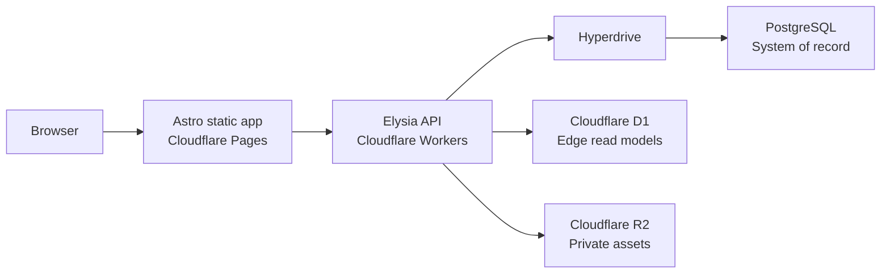

# Scouty 기술 기준

| 항목 | 내용 |
|---|---|
| 상태 | 스캐폴딩 기준 승인 |
| 작성일 | 2026-08-06 |
| 원칙 | 모바일 우선, Cloudflare 배포, PostgreSQL 원장 |

## 1. 목표

초기 구조는 빠르게 실행 가능해야 하지만 PRD의 핵심 무결성, 비동기 미디어 처리, 실시간 연결을 확장할 수 있어야 한다. 도구를 많이 두기보다 배포 경계와 데이터 책임을 명확하게 나눈다.

## 2. 전체 구조



### 배포 단위

| 영역 | 기술 | 책임 |
|---|---|---|
| `apps/web` | Astro, React islands, shadcn/ui | 정적 UI, 브라우저 상태, API 호출 |
| `apps/api` | Elysia, Cloudflare Workers | 인증·권한·비즈니스 규칙·바인딩 접근 |
| `packages/db` | Prisma, PostgreSQL adapter | 원장 스키마·migration·타입 안전한 DB 접근 |

Bun workspace만 사용하고 초기에는 Turborepo 같은 별도 task orchestrator를 두지 않는다.

## 3. 런타임과 패키지 관리

- 로컬 설치·스크립트·workspace·테스트의 기준은 Bun이다.
- 루트 `packageManager`는 실제 사용한 Bun 버전으로 고정하고 `bun.lock`을 커밋한다.
- workspace 의존성은 `workspace:*`를 사용한다.
- 배포된 API 런타임은 Bun이 아니라 Cloudflare `workerd`다.
- Node.js 전용 API는 Workers `nodejs_compat`에서 실제 지원되는 경우에만 사용한다.
- 의존성 추가 전 브라우저, Bun, workerd 중 어느 런타임에서 실행되는지 확인한다.

## 4. Frontend

### 결정

- Astro는 정적 출력으로 빌드한다.
- Cloudflare Pages는 `dist`를 배포하며 Pages Functions를 사용하지 않는다.
- 상호작용이 필요한 부분만 React island로 hydration한다.
- shadcn/ui는 React 19 + Tailwind CSS 4 조합으로 사용한다.
- 아이콘은 Lucide, 글꼴은 self-hosted Pretendard Variable을 사용한다.
- 브라우저 API 클라이언트는 Elysia Eden Treaty를 사용한다.

### 경계

- 비밀값, 데이터베이스, R2 binding에 프론트가 직접 접근하지 않는다.
- 공개 환경 변수는 `PUBLIC_` prefix만 사용하며 비밀을 포함하지 않는다.
- 서버 상태가 필요한 화면은 client island에서 API를 호출한다.
- Astro 컴포넌트를 기본으로 사용하고 지속적인 클라이언트 상태가 필요한 경우에만 React를 선택한다.

### 환경 계약

| 이름 | 용도 |
|---|---|
| `PUBLIC_API_URL` | 브라우저가 호출할 Worker API origin |

## 5. Backend

### 결정

- Elysia 앱 정의와 Cloudflare Worker entry를 분리한다.
- Elysia의 Cloudflare adapter로 컴파일하고 호환 기준일은 `2026-08-06` 이상으로 둔다.
- route schema와 응답 타입은 Elysia에서 정의하고 `App` 타입을 Eden Treaty에 공개한다.
- CORS allowlist는 환경별 `CORS_ORIGINS`로 관리한다.
- runtime binding 타입은 `wrangler types`로 생성한다.

### Worker bindings

| Binding | 타입 | 책임 |
|---|---|---|
| `HYPERDRIVE` | Hyperdrive | PostgreSQL 연결과 connection pooling |
| `EDGE_DB` | D1Database | 읽기 모델·에지 캐시 |
| `ASSETS` | R2Bucket | PDF, 페이지 이미지, 영상, 채팅 이미지 |

### API 규칙

- 모든 외부 입력은 route boundary에서 검증한다.
- 인증, 소유권, 참여자 권한 검증은 handler보다 service 계층에서 재사용한다.
- cursor pagination을 기본 목록 계약으로 사용한다.
- 사용자에게는 안정된 오류 코드와 안전한 문구만 반환하고 내부 오류는 구조화 로그에 남긴다.
- 제안 수락처럼 여러 레코드를 바꾸는 동작은 PostgreSQL 트랜잭션에서 수행한다.
- 재시도 가능한 mutation에는 idempotency key 또는 DB unique 제약을 둔다.

## 6. 데이터 저장소

### PostgreSQL: system of record

다음 데이터의 유일한 원장은 PostgreSQL이다.

- 사용자·프로필·역할
- 에셋 메타데이터와 포트폴리오
- 스카우트 제안과 상태 전이
- 채팅방·메시지·읽음 상태
- 매너 평가·통계 원본
- 차단·신고·알림

Workers에서는 `@prisma/adapter-pg`와 `HYPERDRIVE.connectionString`으로 Prisma client를 만든다. migration과 seed는 직접 PostgreSQL 연결 문자열인 `DATABASE_URL`을 사용한다.

### D1: 파생 읽기 데이터

- 초기 스캐폴딩에서는 binding과 migration 규칙만 만들고 제품 테이블은 만들지 않는다.
- 실제 읽기 모델이 정해지기 전 범용 캐시 테이블을 추측해 추가하지 않는다.
- D1 데이터는 PostgreSQL 원본에서 재생성 가능해야 한다.
- 강한 일관성이나 다중 레코드 트랜잭션이 필요한 판단에 사용하지 않는다.
- Prisma D1 adapter 대신 native binding을 사용한다.

### R2: private object storage

- R2 bucket은 기본 비공개다.
- DB에는 공개 URL이 아니라 storage key와 메타데이터만 저장한다.
- 업로드는 종류·크기·MIME·파일 시그니처 검증 후 만료되는 URL로 수행한다.
- 읽기 URL은 공개 콘텐츠 또는 관계 참여자 권한을 확인한 뒤 발급한다.
- 원본, 파생 이미지, 썸네일, 영상을 kind와 prefix로 구분한다.

## 7. 로컬 개발

- PostgreSQL은 Docker Compose로 제공한다.
- Wrangler의 로컬 D1·R2 시뮬레이션을 사용하며 `.wrangler/state`는 커밋하지 않는다.
- Hyperdrive local connection은 Docker PostgreSQL을 가리킨다.
- `.env`, `.dev.vars`는 커밋하지 않고 `.example` 파일만 관리한다.
- 원격 Cloudflare binding을 사용하는 개발은 명시적 선택으로만 허용한다.

권장 순서:

```text
bun install
→ local infrastructure start
→ Prisma migration and seed
→ Worker + Pages development servers
```

## 8. 테스트와 관측성

- 단위·컴포넌트 테스트는 Vitest를 사용한다.
- Worker와 binding 테스트는 Cloudflare Workers Vitest pool을 사용한다.
- PostgreSQL integration test는 실제 migration이 적용된 격리 DB에서 실행한다.
- Biome, `astro check`, TypeScript, Prisma validate를 CI 필수 단계로 둔다.
- API 로그는 request ID, route, status, duration, safe error code를 포함한다.
- 채팅 본문, OAuth token, signed URL, 자유 텍스트를 로그나 분석 이벤트에 남기지 않는다.
- 업로드·변환 실패율, 메시지 전달 지연, 통계 집계 지연을 관측 대상으로 둔다.

## 9. 배포 원칙

- `web`과 `api`는 독립적으로 build·deploy한다.
- Cloudflare 프로젝트 설정은 각 앱의 `wrangler.jsonc`를 기준으로 한다.
- preview와 production은 별도 origin과 secret을 사용한다.
- DB migration은 API 배포 전에 호환 가능한 순서로 적용한다.
- 배포 과정에서 원격 D1·R2·PostgreSQL 데이터를 자동 초기화하지 않는다.
- CI는 검사와 dry-run build만 수행하고 배포 workflow는 Cloudflare 계정 연결 후 별도 추가한다.

## 10. 주요 제약과 후속 결정

- Elysia의 Cloudflare Worker adapter는 현재 experimental이므로 dependency update마다 build와 runtime test가 필요하다.
- PostgreSQL 호스팅 공급자는 아직 정하지 않았으며 표준 PostgreSQL + Hyperdrive 계약만 고정한다.
- 실시간 채팅 전송 방식, PDF 변환 worker/queue, OAuth 공급자는 후속 설계에서 결정한다.
- D1 읽기 모델은 실제 쿼리 병목과 일관성 요구를 확인한 뒤 설계한다.

## 11. 참고

- [Bun Workspaces](https://bun.sh/docs/pm/workspaces)
- [Astro on Cloudflare Pages](https://developers.cloudflare.com/pages/framework-guides/deploy-an-astro-site/)
- [Elysia Cloudflare Worker integration](https://elysiajs.com/integrations/cloudflare-worker)
- [Eden Treaty](https://elysiajs.com/eden/treaty/overview)
- [Prisma ORM with Hyperdrive](https://developers.cloudflare.com/hyperdrive/examples/connect-to-postgres/postgres-drivers-and-libraries/prisma-orm/)
- [Cloudflare D1 with Prisma](https://docs.prisma.io/docs/orm/v6/overview/databases/cloudflare-d1)
- [Cloudflare R2 Workers API](https://developers.cloudflare.com/r2/api/workers/workers-api-reference/)
- [Cloudflare Workers Vitest integration](https://developers.cloudflare.com/workers/testing/vitest-integration/)
