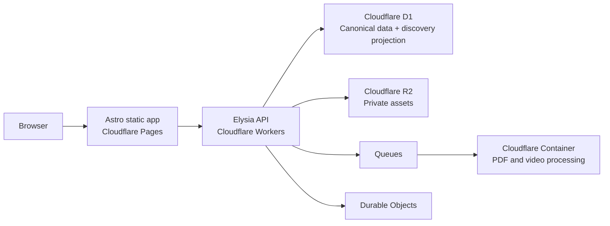

# Scouty 기술 기준

| 항목 | 내용 |
|---|---|
| 상태 | MVP 구현 기준 |
| 갱신일 | 2026-08-07 |
| 원칙 | 모바일 우선, Cloudflare 중심, D1 단일 데이터베이스 |

## 전체 구조

| 영역 | 기술 | 책임 |
|---|---|---|
| `apps/web` | Astro, React islands, shadcn/ui | 정적 UI, 브라우저 상태, API 호출 |
| `apps/api` | Elysia, Workers | 인증, 권한, 비즈니스 규칙, Cloudflare binding |
| `packages/db` | Prisma, D1 adapter | canonical schema와 타입 안전한 DB 접근 |

Bun workspace를 사용하며 API의 실제 production 런타임은 Bun이 아니라 `workerd`다.

## Frontend

- Astro는 정적 출력으로 빌드해 Cloudflare Pages에 배포한다.
- 지속적인 클라이언트 상태가 필요한 최소 영역만 React island로 만든다.
- shadcn/ui, Lucide, self-hosted Pretendard Variable을 사용한다.
- 비밀값과 Cloudflare binding에는 브라우저가 직접 접근하지 않는다.
- 공개 설정은 `PUBLIC_` prefix만 사용한다.

## Backend

- Elysia 앱과 Worker entry를 분리한다.
- route schema에서 외부 입력을 검증하고 service에서 인증·권한·상태 전이를 판단한다.
- Scalar API 문서는 production의 `/docs`, OpenAPI JSON은 `/docs/json`에서 제공한다.
- 재시도 가능한 mutation은 idempotency key나 DB unique 제약을 가진다.

### Worker bindings

| Binding | 타입 | 책임 |
|---|---|---|
| `DB` | D1Database | canonical 데이터와 discovery projection의 단일 저장소 |
| `ASSETS` | R2Bucket | PDF, 페이지 이미지, 영상, 채팅 이미지 |
| `PORTFOLIO_PROCESSING` | Queue | 미디어 처리 작업 전달과 재시도 |
| `CHAT_ROOMS` | Durable Object | 채팅방별 WebSocket fan-out |
| `MEDIA_PROCESSOR` | Container | PDF 페이지·썸네일·영상 메타데이터 처리 |
| `ANALYTICS` | Analytics Engine | 개인정보 없는 제품 이벤트 |

## D1 데이터 계약

D1 `scouty-edge`가 유일한 데이터베이스다. 사용자, 프로필, 포트폴리오, 제안, 채팅, 평가, 차단, 신고, 알림과 공개 탐색 projection을 모두 저장한다. Hyperdrive, PostgreSQL, `DATABASE_URL`은 사용하지 않는다.

- Prisma는 `provider = "sqlite"`와 `@prisma/adapter-d1`을 사용한다.
- Prisma가 표현하지 못하는 partial unique index와 CHECK 제약은 Wrangler D1 migration SQL에 둔다.
- 공개 탐색 projection은 같은 D1 안의 별도 테이블이며 canonical 데이터에서 재생성할 수 있다.
- 역할 taxonomy는 배포 때마다 seed하지 않고 migration의 release data로 관리한다.
- 적용된 migration은 수정하지 않고 새 번호의 migration을 추가한다.
- production migration은 API 배포 전에 `bun run db:deploy`로 명시적으로 적용한다.

D1 Prisma adapter는 interactive transaction을 지원하지 않는다. 기존 service callback은 순차 실행되며 동시성 핵심 규칙은 unique/CHECK 제약과 idempotency key로 보호한다. 새 다중 쓰기 기능에서 전부 성공하거나 전부 실패해야 한다면 native `D1Database.batch()`로 설계하고 실패 복구 테스트를 함께 추가한다.

## R2와 미디어

- R2 bucket은 비공개이며 DB에는 공개 URL 대신 storage key를 저장한다.
- API가 권한을 확인한 뒤 짧게 만료되는 signed URL을 발급한다.
- 업로드는 MIME, 크기, 파일 시그니처를 검증한다.
- Queue는 재시도를 담당하고 Container 작업은 같은 입력으로 다시 실행해도 안전해야 한다.

## 테스트와 배포

- Vitest는 도메인·API 단위 테스트에 사용한다.
- Workers Vitest pool은 실제 workerd와 로컬 D1 migration을 사용해 상태 전이·동시성·제약을 검증한다.
- Playwright Chromium과 axe-core로 production build의 핵심 흐름과 접근성을 검사한다.
- CI는 lint, typecheck, 단위·D1 통합·E2E 테스트, Worker build, Container build만 수행한다.
- CD는 두지 않으며 production은 운영자가 로컬 Wrangler로 배포한다.
- readiness는 D1, R2, OAuth, R2 signing, Queue 설정을 검사한다.

## 참고

- [Prisma ORM with Cloudflare D1](https://www.prisma.io/docs/orm/v6/overview/databases/cloudflare-d1)
- [Cloudflare D1 Worker API](https://developers.cloudflare.com/d1/worker-api/d1-database/)
- [Cloudflare Workers Vitest integration](https://developers.cloudflare.com/workers/testing/vitest-integration/)
- [Cloudflare R2 API tokens](https://developers.cloudflare.com/r2/api/tokens/)
- [Cloudflare Containers](https://developers.cloudflare.com/containers/)
